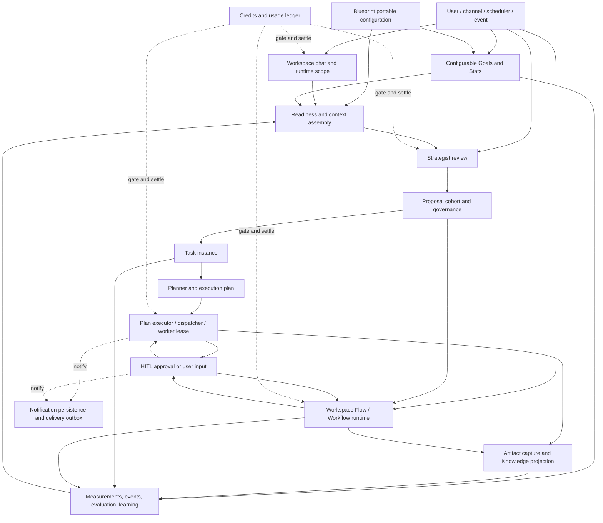
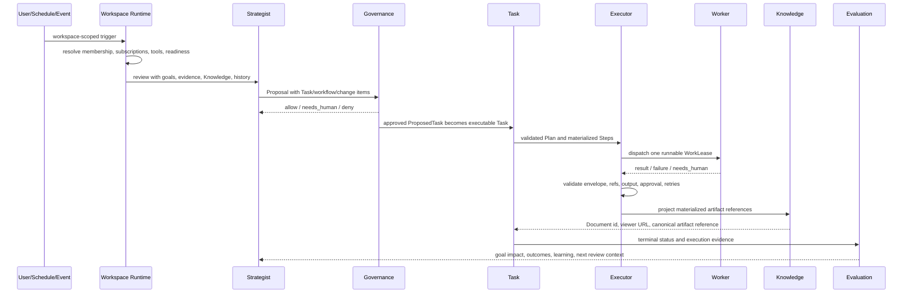

# Manor Workspace Architecture

This document describes the Workspace runtime and its verified boundaries. It
is a navigation and change-impact contract for engineers and coding agents.
The invariants below apply to the code paths named in each node and their
listed tests; they are not a claim that every legacy entrypoint has identical
coverage. When prose and code disagree, inspect the listed code entries and
update this document with the code change or mark the gap explicitly.

## Evidence status

- **Implemented** means a named code path exists and has a focused regression
  test. It does not mean every caller is covered.
- **Projection** means a runtime value is portable or user-visible only after
  the named projection/installer path runs; a filesystem path, model claim, or
  raw database row alone is not evidence.
- **Gap** means the repository currently has no complete implementation proof.
  A gap is recorded here so a future change cannot treat the statement as an
  existing guarantee.

## System view

The solid arrows are business-state transitions. The dotted credit edges are
cross-cutting controls. Governance is also cross-cutting: Proposal approval,
Plan/Step approval, Workflow action approval, and direct chat tool approval
share policy concepts but have different execution origins and resume paths.

## End-to-end operating loop

This is the autonomous Task path. A Workflow can be launched directly by the
user, scheduler, event, or Proposal; it does not become a Task Plan. Workflow
nodes execute inside `WorkflowRun`, while Task steps execute inside
`ExecutionPlan` and `ExecutionStep` through the Dispatcher.

## State ownership map

| State | Owner | Scope | Portable in Workspace Blueprint |
| --- | --- | --- | --- |
| Workspace shell and operating model | `Workspace` | Workspace | Yes, safe configuration only |
| Goal and Stat configuration | `Goal` (stable `goal_key`, target, source/cadence, Stat binding) and `WorkspaceStat` (collector definition/revision) | Workspace; a Goal may also be entity-scoped | Yes for definitions, safe baseline and portable source configuration; no for observations, measurements, current values, pace, task links, or schedule runs |
| Goal and Stat runtime evidence | `GoalMeasurement`, `WorkspaceStatObservation`, `GoalTaskLink`, goal/stat current value and pace | Workspace/runtime | No |
| Agent deployment | `AgentSubscription` | Workspace | Yes, by service key and agent slug |
| Connected integration account tool discovery | `MCPAccountToolCatalog`, projected through the actor-scoped runtime integration registry | User/entity account runtime | No; contains credential-free schemas only and is valid only for the saved endpoint, bounded cache age, and matching actor account-registry snapshot |
| Strategist behavior constraints | `operating_model.strategist` | Workspace | Yes |
| Proposal cohort and decisions | Proposal records, proposed `Task` rows | Runtime | No |
| Task | `Task` | Workspace or entity | No |
| Plan and Step | `ExecutionPlan`, `ExecutionStep` | Task/runtime | No |
| Worker lease | `WorkLease` | Step/runtime | No |
| Workflow definition | `WorkflowDefinition` | Workspace or entity | Yes when Workspace-owned/bound |
| Workflow deployment | `WorkflowBinding` | Workspace | Yes |
| Workflow execution and project state | `WorkflowRun`, `WorkflowProject` | Runtime | No |
| Workflow action grant | `WorkflowActionGrant` | Runtime/Workspace | No |
| Automation definition | `ScheduledJob`, binding trigger config | Workspace | Yes when Workspace-scoped |
| Automation runs | `ScheduledJobRun` | Runtime | No |
| Artifact file | Entity filesystem | Workspace path | No as runtime output |
| Artifact index | `Document` plus provenance | Workspace/Knowledge | Starter content is portable; runtime artifacts are user-visible only after projection |
| Approval request/grant | HITL/governance records | Runtime/policy | Policy yes; decisions and tokens no |
| Credits | grants, reservations, transactions, usage | Entity/runtime | No |
| Twilio Voice call runtime | `TwilioVoiceCallSession` | User/Entity and optional Workspace runtime | No; call sessions, provider identifiers, stream-token digests, and usage state are not Blueprint-portable |
| Notification and external delivery intent | `Notification`, `NotificationOutboxEvent`, `NotificationDelivery` | Entity/Workspace/runtime | No |
| Task categories/SLA/escalation | task policy rows | Entity | No; configure through entity-level administration, never Workspace Blueprint |

## Node catalog

Each node uses the same fields so an impact review can be performed without
guessing ownership.

### WS-01: Create, install, and configure Workspace

Purpose: materialize the Workspace shell and its declared operating parts.

- Code entry: `packages/core/services/entity_service.py`,
  `packages/core/services/workspace_setup_service.py`,
  `packages/core/services/workspace_draft_service.py`,
  `packages/core/blueprints/installer.py`, and the Workspace/Blueprint API
  routers, including `apps/api/routers/workspaces.py` for deployment-local
  Webchat page configuration.
- State: `Workspace`, memberships, subscriptions, Goal/Stat definitions and
  collection schedules, Knowledge folders, workflow definitions/bindings,
  scheduled jobs, policy, install provenance, and explicit public-page
  references stored on a Workspace Channel binding.
- Success invariant: a fresh Workspace resolves all declared portable parts to
  new local identities, records install-time todo results separately from every
  required live setup declaration, and never reuses source row IDs or
  credentials. Required external Blueprint channels select an accessible
  user-owned credential source before Workspace mutation and create only the
  Workspace routing binding inside the install transaction. A dependency that
  passed during install remains re-checkable
  after later disablement. Required MCP binding fields remain live readiness
  checks; optional MCP requirements may produce setup guidance but never block
  normal work.
  WhatsApp Business Connect is account-only: Embedded Signup creates one
  user-owned, provisioned `Integration` and one source-linked, unbound
  `ChannelConfig`. It never selects an Agent or creates a `Channel`; the
  existing Agent Binding service separately writes the exact
  AgentSubscription/Workspace route.
- Failure boundary: partial setup must not be reported runnable. Installation
  either fails transactionally or returns explicit blocking todos/readiness.

### WS-02: Resolve runtime scope and Workspace chat

Purpose: turn a conversation, Task thread, channel message, or worker turn into
one bounded Workspace runtime envelope.

- Code entry: `packages/core/services/workspace_runtime.py`,
  `packages/core/services/task_session.py`,
  `packages/core/services/assistant_blocks.py`,
  `packages/core/services/response_surfaces.py`,
  `packages/core/ai/mcp/email.py`,
  `packages/core/services/channels/email_adapter.py`,
  `packages/core/services/channel_gateway.py`,
  `packages/core/services/runtime_chat_context.py`,
  `apps/api/routers/channels/voice_stream.py`,
  `packages/core/services/voice/binding.py`,
  `packages/core/services/voice/session.py`,
  `packages/core/services/voice/work_queue.py`,
  `packages/core/services/voice/work_router.py`,
  `packages/core/workspace_chat/context.py`,
  `packages/core/workspace_chat/service.py`, `apps/api/routers/workspace_chat.py`,
  `apps/api/routers/chat.py`, and `apps/api/routers/public_chat.py`.
- State: `Conversation`, `Message`, `workspace_id`, `task_id`, runtime/tool
  profiles, subscription-bound Agents, open pending actions, task blockers,
  canonical user feedback subjects, Webchat visitor session/contact scope, and
  the runtime projection of explicitly published Workspace content references.
- Success invariant: the turn sees only the target entity/Workspace/Task,
  correct service Agents and tools, plus unresolved HITL relevant to that
  conversation. Runtime defaults, Agent bindings, and Workspace/Task overlays
  resolve to one run-local effective tool scope consumed by prompt assembly,
  `search_tools`, and the execution gate. Search may progressively load a
  schema from that scope but cannot add a first-party permission; execution
  still revalidates the current durable or contextual binding. Provider-level
  MCP wildcard/action scope remains semantic run-local authority in the Runtime
  envelope; it is not flattened into old catalog names and is not persisted in
  message metadata for a later turn to replay. An `interactive`
  Task thread always resolves and binds its
  sole Host Agent from the Task assignment or owner subscription before Skill,
  prompt, tool, billing, and message-author resolution; request Agent IDs and
  mentions cannot replace that Host. A completed Plan has one feedback subject
  per user even when its receipt is projected into multiple conversations;
  taskless completed Plans remain rateable through a Plan subject. Deleting the
  owning Task retires its completion message markers, canonical feedback, and
  reviewer evidence in the same transaction, so an orphan projection cannot be
  rated afterward. Current feedback writers require an explicit typed target,
  canonical target ID, and server mutation revision; historical completion
  headlines and per-message metadata maps are accepted only by the upgrade
  migration, never by runtime classification or dual-write paths. The canonical
  completion producer takes the same subject
  lock and revalidates completed Plan/Task lineage before posting, so a delayed
  worker cannot recreate that projection after deletion. A supplied
  Conversation identity must
  still resolve in its entity scope and never downgrades to an unscoped turn.
  Internal Chat may persist a validated response surface in the assistant
  message block stream. Registered templates and generated HTML share one
  versioned contract, one isolated renderer, a complete text fallback, and a
  bounded action bridge that returns user input through the existing Chat turn;
  the embedded document never receives Manor API, credential, storage, or
  network access. Generated surfaces are declarative HTML/CSS only; JavaScript
  behavior is available exclusively through reviewed, registered templates, so
  model-generated code cannot widen the bridge or browser capability boundary.
  User-triggered Agent provisioning carries the authenticated actor into Skill
  resolution; exact IDs and legacy slugs bind only Skills that actor may read,
  while trusted Blueprint/setup orchestration remains an explicit internal path.
  Runtime Skill discovery and invocation share the same tenant, active-state,
  user-resource, Agent-binding, and installed Workspace Ledger eligibility
  boundary; hiding a Skill from the prompt catalog is never the execution gate.
  WhatsApp Business inbound resolves `metadata.phone_number_id` to one active
  owner-matched `ChannelConfig`, one active `Channel`, and the exact active
  AgentSubscription/Workspace saved by Agent Binding. It never uses a
  `ChannelContact.agent_subscription_id` override or timestamp recency to
  choose among ambiguous routes.
  Browser Voice admits each non-control utterance as one visible user `Message`
  carrying a bounded `voice_work` lifecycle before it can report the work as
  queued. Native Realtime and the shared STT/Chat/TTS Gateway then execute that
  same origin through the ordinary Chat or Channel runtime, preserving one
  authority for tools, approvals, budget, history, and assistant origin
  metadata. Admission immediately starts the receipt in the background, emits
  `work:running`, and returns the call to `listening`; elapsed time never
  creates an Assistant turn. The data flow is transcription -> durable user
  Message/receipt -> pending/running lifecycle -> ordinary Chat execution ->
  terminal receipt plus the real Assistant result -> caption/audio/final turn.
  Explicit progress questions and narrow call-level corrections stay in a
  local foreground control plane. While one receipt is
  running, that control plane compares each new utterance with the active
  request and the latest available non-control Assistant output without sending
  either to another model. A typed decision factory maps that context to enum
  actions, reply kinds, durable states, and UI states consumed by both browser
  transports. `STATUS` reports the persisted running/completed state and any
  real Assistant output already available; `CANCEL` and `REPLACE` operate on
  the exact receipt; `QUEUE` persists the new request and its direct reply names
  both the active and queued requests. Status and ambiguous corrections do not
  create new work. There is no timeout acknowledgement or synthetic progress
  text. Only complete, explicit stop or replacement phrases mark that exact
  Voice receipt interrupted; its Agent polls the receipt directly so sibling
  text turns in the same conversation are unaffected. Replacement is admitted
  as a new durable receipt and starts after the prior Agent reaches its
  cooperative cancellation point. If the user explicitly replaces again
  during that safe exit, the earlier pending replacement is marked interrupted
  and skipped rather than being executed before the newest request.
  A cancelled receipt is marked interrupted, its stale result is not spoken,
  and already committed external effects are not represented as rolled back.
  Twilio Voice creates its exact Channel `Conversation` before accepting the
  Media Stream, freezes the Call's Channel/AgentSubscription/Agent/Workspace
  scope, and admits every non-control utterance under the Call session ID. It
  acknowledges admitted work without waiting for the Agent, keeps listening
  while that receipt runs, and uses the same `STATUS`/`QUEUE`/`CANCEL`/`REPLACE`
  control semantics. A changed binding interrupts pending Call work, suppresses
  a stale running result, and never migrates the Call to the replacement Agent.
  Work admitted before the Media Stream closes continues through its durable
  queue, but a closed Call performs no further Realtime provider output.
  Provider speech responses are serialized until the preceding
  `response.done`, so control acknowledgements and final Agent replies do not
  overlap.
  Foreground control text is exposed before its TTS request so provider delay
  never leaves an unexplained Thinking state. Normal Assistant captions are
  exposed only with audio, accumulate incrementally for the active turn, and
  become a completed call-log turn after the native response completes or the
  Gateway's final clip finishes; the final turn must not hide its own live
  captions at the first audio frame. A dominant CJK language in recent user
  messages supplies only an ISO transcription hint, so short audio
  is less likely to switch scripts without sending conversation history to a
  second model. Pending receipts can resume on the next call. A receipt found
  `running` after process loss is marked interrupted and is never replayed
  automatically because an external side effect may already have committed.
  A repository-controlled capability companion remains an ordinary searchable
  Skill and is returned beside a matched available Tool/MCP capability without
  consuming its result slot, marked to load before that paired capability is
  used. Unavailable providers and uninstalled Ledger contracts cannot surface a
  companion, and `invoke_skill` still revalidates the current runtime boundary
  before loading its instructions. Every static Integration catalog key owns one
  complete concrete child Skill through the Integration route registry. That
  registry derives the child Skill's `mcp__<provider>__` discovery and companion
  prefixes; provider Skill configs do not duplicate them. Browser-only routes
  share the Chrome Skill, while non-Integration core Tool Skills use an explicit
  trusted `capability_companion` binding.
  Every registered or dynamically discovered public tool call validates the
  model-authored arguments against the exact schema bound to that run before
  authorization, approval creation, or handler execution. Runtime-only control
  fields are excluded from the public instance contract and are never coerced
  from strings into arrays or objects.
  Generic Email MCP calls inherit the same run-local actor and Workspace scope:
  saving a received attachment creates a bounded Workspace/Knowledge artifact,
  while an outgoing `document_id` is read only after current document ACL and
  Workspace scope validation. Email Channel attachment bytes are bounded before
  queueing, are not persisted in message logs, and are exposed to the Agent only
  through canonical saved-document refs plus bounded extracted text.
  A background Sandbox execution may expose bounded structured events through
  its exact runtime-owned Sandbox and execution identities. Status reads use an
  incremental sequence cursor, and responses revalidate the same actor,
  Entity, Agent, and Conversation ownership before delivery. A `need_tool`
  event is untrusted advisory data: the Agent must resolve it through the
  ordinary Runtime tool catalog, authorization, approval, and capability gate;
  neither the event nor a response can grant a capability. Credential exchange
  is reference-only by contract, and secret-shaped fields fail closed.
- Failure boundary: a missing/deleted/inaccessible Workspace fails closed and
  must not fall back to entity-wide tools, another Workspace, or a fresh task.
  A missing or deleted Conversation also fails closed instead of using the
  request Agent or Manor AI as a fallback.
  A tool execution failure remains a tool observation for the model and cannot
  directly terminalize the Agent loop through `stop_parent`, a matching
  terminal-success policy, or a media completion shortcut. Repeated all-error
  rounds use the bounded circuit breaker to remove callable tools and request a
  final model summary rather than returning an error terminator. Runtime
  suspension, user cancellation, credit admission, billing settlement, and
  deliberate successful terminal tools keep their separate control semantics.
  Invalid tool input returns a structured field/rule error without echoing
  sensitive values, mints no HITL request, and consumes no approval.
  An interactive Task with a missing, inactive, conflicting, or ambiguous Host
  fails before a provider call and never falls back implicitly to Manor AI.
  Completion feedback fails closed unless its normalized Plan/Task lineage is
  in the same Workspace and completed; it never borrows an unrelated preceding
  user turn as its request context.
  Invalid or unsupported response surfaces are dropped before persistence;
  external, background, and non-interactive runtime surfaces cannot render one.
  Voice settlement is bounded: a timed-out active instruction is cancelled and
  marked interrupted, while accepted pending instructions remain recoverable.
  A progress question never claims an instruction receipt, and status intent
  must match the complete short utterance so commands containing words such as
  `status` or `progress` still reach the Chat Agent. Ambiguous, additive, or
  unrelated speech defaults to the serial queue and can never cancel active
  work; only explicit control language crosses the interruption boundary.

### WS-03: Readiness and context assembly

Purpose: determine whether useful work can start and assemble the evidence the
Strategist or agent is allowed to use.

- Code entry: `packages/core/services/workspace_readiness.py`,
  `packages/core/strategist/context.py`, Knowledge visibility/memory services,
  integration resolution, and goal/stat services.
- State: active subscriptions, allowed service keys, configured providers and
  channels, Goal/Stat definitions (including collector/source and cadence),
  actor-callable integration accounts and fresh account-scoped MCP operation
  snapshots,
  Knowledge nets, operating memory, recent work, governance policy, open
  proposals, and readiness blockers.
- Success invariant: readiness reflects concrete installed resources; context
  is Workspace-scoped and bounded, and declared missing dependencies remain
  visible as blockers rather than being invented by prompts. Goal direction is
  configurable: an external measurement source requires its named Workspace
  integration only when that source is configured, while manual and
  `workspace_internal` collection do not invent a provider dependency. Goals
  are not otherwise a readiness prerequisite for ordinary or autonomous
  Workspace operation.
- Success invariant: Agent requirements resolve the declared Agent identity and
  an active bound worker, not merely another subscription sharing its service
  key. Scheduled-job checks require the installed Workspace-scoped id and an
  enabled job; Workflow checks require both an active binding and active
  definition; required MCP checks require the declared active binding, tool
  allowlist, and non-secret binding configuration.
- Success invariant: live MCP discovery may extend a wildcard provider binding,
  but never an explicit action allowlist; account capability snapshots are
  filtered by actor, endpoint, and cache age before entering context. A cached
  dynamic binding is reused only while its ordered account identities, typed
  registry load status, remote endpoint, and token transport still match the
  current actor registry and managed server configuration.
  WhatsApp Business account readiness separately proves the exact OAuth
  connection and WABA/phone relationship, connected phone registration, exact
  deployment Meta App subscription, and fixed callback. It does not query or
  imply Agent Binding readiness.
- Failure boundary: missing configured setup changes the proposed work or
  blocks measurement before external execution. Entity integrations unrelated
  to the Workspace, or unrelated to a configured Goal/Stat source, must not
  leak into context.

### WS-04: Strategist review and Proposal generation

Purpose: convert current goals when present, primary work, and evidence into a
bounded, typed Proposal.

- Code entry: `packages/core/tasks/ai_tasks.py` review dispatch,
  `packages/core/strategist/service.py`, `context.py`, `prompt.py`,
  `proposal.py`, and review briefing services.
- State: `ReviewRun`, Proposal payload, proposed `Task` rows, proposal items,
  proposed Goal changes, configured Goal/Stat evidence, review evidence, and
  chat proposal card.
- Success invariant: `ProposedTask` owner/delegates are constrained to active
  subscriptions; dependencies and deliverables validate; Goal changes address
  the stable `goal_key`, not an ambiguous metric; duplicate/open work suppresses
  another scheduled cohort; Task rows are persisted only after the full Proposal
  validates. While Blueprint setup blocks normal work, the live setup state is
  re-read at the persistence boundary, model-authored Tasks are discarded, and
  only explicitly allowlisted human setup requests may survive. Automated setup
  runs only through the exact Blueprint ScheduledJob admitted by WS-03.
- Failure boundary: invalid output gets bounded repair/failure, open proposals
  do not stack, credit exhaustion creates no new Task cohort, and Task creation
  is never derived from Blueprint `task_templates`.

### WS-05: Proposal governance and cohort decision

Purpose: decide whether proposed Tasks, workflow runs, experiments, human
requests, and Workspace changes may proceed.

- Code entry: Proposal governance in `packages/core/strategist/service.py`,
  `packages/core/proposals/`, and `packages/core/governance/approvals.py`.
- State: Proposal record/items, HITL request, standing grants, Task status,
  decision reason, and proposal chat card resolution.
- Success invariant: one cohort decision is traceable to its review; deny,
  needs-human, and allow produce distinct states; external action Tasks use the
  higher-risk action key; selected dependencies remain valid.
- Failure boundary: an expired or mismatched approval cannot authorize a
  different payload. Reject/cancel must not dispatch Tasks or Workflows.

### WS-06: Task lifecycle and planning

Purpose: turn an approved execution Task's business contract into a validated
executable Plan DAG, while keeping an `interactive` Task on its task-scoped
conversation runtime rather than dispatching it as background Plan work.

- Code entry: `packages/core/models/task.py`,
  `packages/core/services/task_state_machine.py`,
  `packages/core/services/task_service.py`, `packages/core/plans/planner.py`,
  `packages/core/plans/schema.py`, `packages/core/plans/service.py`,
  `apps/api/routers/plans.py`, and Task dispatch functions in
  `packages/core/tasks/ai_tasks.py`.
- State: `Task` (including a dedicated `status_changed_at` lifecycle clock),
  dependency links, expected output/deliverables, runtime capabilities,
  `ExecutionPlan`, materialized `ExecutionStep` rows, and the renewable
  Task-planning execution claim.
- Success invariant: Task status transitions are legal; the Plan is acyclic;
  one Task has at most one non-terminal Plan across Planner, worker, and manual
  persistence entrypoints; a Plan generated while its Task inputs change is
  discarded before persistence. API and worker planning share one durable
  Task-level claim through provider work and the fenced Plan commit, so a
  duplicate request cannot enter the billable Planner path. A delivery that
  rediscovers a committed non-terminal Plan republishes that exact Plan rather
  than acknowledging it without dispatch. Planning failure locks Workspace then
  Task and cannot replace a Task state backed by a committed active Plan;
  service keys remain within owner/delegate scope; hard Task output is bound to
  exactly one terminal producer step; dependencies block until predecessor
  evidence is available. Provider actions and schemas are derived only from
  accounts callable by the resolved Task requester, with the managed server catalog as the
  credential-free fallback. User-triggered planning resolves the Task inside
  the caller's Entity, locks and requires write access to its active Workspace
  before any Planner/provider work, rejects interactive or terminal Tasks, and
  rejects manual Task or AgentSubscription references whose Workspace or
  service key falls outside the Plan owner's Task owner/delegate scope. Background
  planning follows the same Workspace-before-Task lock and revalidation order.
  User Plan mutations lock and revalidate Workspace before Task and Plan so
  approval, cancellation, and retry serialize with pause/delete.
- Failure boundary: planning failure, ambiguous terminal output, unsupported
  step kinds, unresolved dependencies, or missing credits must not mark the
  Task complete or start partial execution silently. Interactive Tasks must
  not enter the background Planner/Runner merely because they have an Agent.
  Deleting an interactive Task first cancels its active or queued durable chat
  run and removes the session Conversation, so a delayed turn fails closed.
  No Task can be planned while the Workspace's Blueprint setup gate is active,
  including a Task proposed before a dependency later became unavailable.
  Automated setup uses the matching server-owned Blueprint ScheduledJob rather
  than a model-authored Task key.

### WS-07: Plan execution, Dispatcher, and worker lease

Purpose: execute runnable Plan steps once, with retries and captured evidence.

- Code entry: `packages/core/plans/executor.py`,
  `packages/core/dispatcher/service.py`, `packages/core/models/worker.py`,
  `packages/core/ai/task_runner.py`, the shared renewable execution-claim
  service, scheduler API/mutation factory and Skill-generation task, internal
  worker execution, and Agent/`execute_lease`/`run_plan` tasks.
- State: Plan/Step status, `WorkLease`, execution claim, attempt counters,
  result envelope, tool evidence, error, execution events, scheduled occurrence
  and its durable `PREPARED`/`PUBLISHED` child handoff, and bounded worker
  shutdown of event persistence/delivery tasks. ScheduledJob definitions carry
  an indexed UTC `next_run_at` clock and a revision-scoped Skill-generation
  recovery intent. Skill generation is claimed by exact ScheduledJob ID plus
  configuration revision; these fields are runtime coordination, not
  Blueprint-portable state.
  A live background Sandbox command additionally owns a bounded, ephemeral
  event/response mailbox keyed by its exact execution id. The mailbox is
  execution runtime state, is removed with Sandbox/history cleanup, and is not
  Blueprint-portable.
- Success invariant: dependency-ready steps receive at most one active lease;
  only the claimed worker can complete it; results pass schema/reference and
  artifact checks; terminal Plan state reconciles exactly once to Task state.
  A background Agent Task has at most one live execution claim; a duplicate
  delivery that observes a live or possibly stale claim publishes a delayed
  recheck before acknowledging, and the Task terminal guard makes recovery
  delivery a no-op after successful completion. A worker that loses an Agent
  Task claim never republishes the business task with a new wire argument or
  re-enters `TaskRunner`: it commits a versioned recovery intent on the Task and
  publishes a settlement-only delivery to `recovery-v2`. A bounded periodic
  sweep claims only due intents with skip-locked rows, defers the next attempt
  beyond the full settlement retry chain with bounded exponential backoff, and
  fences broker-failure release by a unique publish token. This prevents stale
  publishers and short sweep intervals from multiplying recovery chains. The
  settlement task must reacquire the same execution claim before making the
  Task terminal. A token-guarded, renewable
  PostgreSQL row lease is the single authoritative claim domain for Workflow,
  Agent Task, and scheduled-child execution. Acquire, heartbeat, and release
  use short transactions, so long provider work does not pin a database
  connection and cache availability cannot create an independent claimant.
  Every claimed terminal commit validates and row-locks that same durable claim
  token inside the business transaction, preventing an expired owner from
  committing after a successor takes the lease. Scheduled Skill generation
  commits both the authoritative Job diff and its generation intent before
  queue publication; a bounded sweep republishes failed broker handoffs. It
  claims and admits only enabled Jobs, admits one live worker for that exact
  Job revision, persists a bounded provider-attempt count before billable work,
  and ends its read transaction before LLM work. It then re-enters through
  lifecycle -> Job -> Skill locks, revalidates enabled state and both revisions,
  and clears the intent only in the commit that installs the generated Skill.
  Every accepted prompt change creates a new Skill and atomically rebinds the
  Job; it never rewrites the prior definition or its MinIO directory, so shared
  references and a rolled-back final fence continue to observe committed
  content only. Generated versions retain the Job owner's Entity/Workspace
  scope and advance one portable version family. A failed database persistence
  or final claim fence removes the uncommitted object-store prefix. Scheduled
  execution binds that exact Skill ID to the child Task and forces the canonical
  `invoke_skill` runtime before the Agent's first model response, preserving the
  full scripts/references/requirements/tool-policy bundle instead of flattening
  it into a copied system prompt.
  Disabling a Job pauses its unfinished intent without provider work; exhausted
  attempts close the active intent with an operator-visible error, while a
  prompt/Agent edit or disable-enable cycle opens a fresh bounded attempt window.
  Same-value concurrent API updates therefore neither enqueue nor bill twice.
  Losing renewal poisons the owning coroutine until it exits: cancellation is
  repeated across later await boundaries, and claim owners re-check the lost
  fence before their terminal commit/handoff boundary so suppressing one
  cancellation cannot continue ordinary post-loss work. Agent TaskRunner,
  Workflow execution, manual Workflow steps, scheduled child cancellation, and
  scheduled occurrence settlement mark that fence closed immediately after
  their durable business commit/handoff, so later event/comment/billing or
  claim-release cleanup cannot reinterpret committed work as a claim loss.
  Every scheduled Agent occurrence owns a distinct Task and carries
  immutable ScheduledJob/ScheduledJobRun identities through every terminal
  path. Scheduler-generated occurrence keys include the ScheduledJob revision;
  workers reject queued keys after an execution-config revision change, while
  the tick claims its dispatch clock only after reloading the same persisted
  occurrence. During a rolling upgrade, an old Beat message receives a separate
  bounded dispatch-clock wait budget; if the old transaction still has not
  committed, the worker revalidates and consumes the exact legacy occurrence
  instead of silently dropping it through generic retry exhaustion. Explicitly
  re-enabling a terminal delete-after definition creates
  a new revision and occurrence, but never overlaps a still-running occurrence.
  The scheduler tick reads bounded pages from the indexed `next_run_at` clock;
  writers recompute that clock under the Job lock after schedule/configuration
  changes and occurrence claims. A broker-accepted child remains a durable
  `PUBLISHED` running handoff with an execution-recheck deadline. Admission
  restarts that deadline so queue delay does not consume the execution window.
  Before closing an admitted generic body, the scheduler sweep locks and
  rechecks the authoritative claim row: a live claim defers recovery, while an
  expired or absent claim closes as an inspectable ambiguous error because its
  external effects cannot be proven absent. After a child claim lease expires,
  the sweep republishes only Agent/Workflow children that have their own durable
  terminal guard. Workflow recovery marks its non-recursive claim recheck in a
  broker header that older workers safely ignore instead of adding an
  incompatible task argument. A projection
  failure before `PUBLISHED` remains durable `PREPARED`.
  A
  terminal occurrence receives projection-only recovery, and a
  settlement-pending occurrence retries settlement only, so completed business
  work cannot be reopened while the exact run's ledger projection is repaired.
  If the current owner cannot write the settlement fence, it does not publish
  directly with an unfenced token; on paths without an execution claim, the
  same replacement applies when both the fence write and initial dedicated
  publication fail. The completed business delivery replaces itself with the
  typed settlement task instead of adding a new argument to the business task
  or re-entering its body. Settlement tasks and replacements route through the
  version-isolated `recovery-v2` queue: pre-upgrade workers do not subscribe to
  that queue, so a
  rolling deploy or rollback leaves the message pending for a compatible
  consumer rather than raising on a new signature or applying old fencing
  semantics. Generic settlement reacquires the occurrence execution claim and
  fences its terminal commit; a replaced token can neither persist nor directly
  enqueue the old owner's settlement. Both settlement paths have a finite retry
  budget; the periodic recovery sweep starts a later bounded chain while the
  durable settlement intent remains pending.
  A successful scheduled Agent result bound for Workspace Chat persists a
  typed projection intent on that exact occurrence; the Message and delivered
  state commit together, realtime fanout starts only after commit, and a
  projection-only task plus the bounded scheduler sweep recover pending intent
  without rerunning the Agent. Projection revalidates the exact Entity,
  Workspace, ScheduledJob, ScheduledJobRun, and Task lineage before creating a
  Message, so a stale or cross-Workspace Task id is quarantined. A
  result-projection recovery chain consumes its
  bounded budget only after a worker starts it, keyed by the stable Celery task
  id; broker publication failures cannot exhaust or quarantine an unexecuted
  projection. Recovery backoff is stored as a numeric UTC epoch; legacy valid
  ISO deadlines are normalized under lock, while invalid calendar values are
  due rather than permanently sorting into the future. Malformed payloads,
  unknown execution states, and recoverable runs whose parent Job is missing
  enter terminal quarantine so an oldest-first batch cannot permanently hide
  later valid recovery work.
  Scheduled child admission locks the parent Job before its occurrence and
  serializes with pause/delete. A disabled or removed occurrence cannot enter
  business execution; its exact, still-pristine Task or WorkflowRun is
  idempotently cancelled while holding the same child execution claim, whereas
  work admitted before a later pause may finish.
  Every new Plan cycle and lease checkout reloads the Workspace's current
  Blueprint setup admission; a regressed dependency pauses already-materialized
  pending work before any new lease is issued.
  Dispatcher schema hydration uses the same resolved-requester account boundary as
  planning and never merges another actor's discovered actions.
  Structured Sandbox events receive server-assigned monotonic sequences;
  responses bind one exact response-requiring event, are idempotent for an
  identical payload, and resume the same process rather than starting another
  command. Event count, line size, stream size, response size, and history
  lifetime are bounded.
- Failure boundary: stale/duplicate leases cannot complete a step; retry limits
  terminate visibly; a worker claim of success without required effects/files
  triggers replan/failure rather than false completion. A committed business
  task does not remain on an active lease when the model provider requests
  cooperative rate-limit backoff: the lease becomes a bounded, Retry-After-aware
  pending retry without consuming a business attempt, while credit exhaustion
  terminates visibly instead of burning the remaining attempts. One-shot model
  failures retain their provider status rather than collapsing into an empty
  response. If initial queue delivery fails after a Plan commit, retries target
  that same Plan rather than invoking the planner again; exhausted delivery
  becomes a visible Task recovery action. A committed business task does not remain unacknowledged
  indefinitely for external event delivery;
  interrupted delivery is resumed from durable EventLog state instead of
  replaying the business task. A crashed Agent worker leaves only a bounded
  renewable lease; delayed recheck recovers after expiry rather than abandoning
  the nonterminal Task. A lease admitted before setup regresses may finish; the
  stricter gate applies to later Plan cycles and new leases.
  Sandbox mailbox delivery proves that a response was atomically made
  available, not that untrusted code consumed it. A terminal, cancelled,
  expired, foreign-owned, unknown-event, conflicting duplicate, oversized, or
  secret-shaped response fails closed.

### WS-08: HITL, approval, pause, and resume

Purpose: pause an exact execution origin for approval, login, user input, or
operator intervention, then resume that same origin.

- Code entry: `packages/core/governance/approvals.py`,
  `packages/core/dispatcher/service.py::lease_needs_human`,
  `packages/core/services/task_blockers.py`,
  `packages/core/services/step_resume.py`, pending-action services, and
  Workspace chat resolution routes.
- State: HITL request, pending action, approval payload hash/token, paused
  Step/Lease/Workflow node, user response, consumed decision, resolved UI
  message, a bounded typed runtime-tool continuation, and the frozen provider
  retry-mode snapshot on external-reply claim and delivery-attempt state.
- Success invariant: approval is scoped to exact action and arguments; one
  response is consumed once; the original Task/Plan/Workflow resumes without
  starting a duplicate execution; terminal/cancel cleanup resolves stale cards.
  When multiple HITL requests share one Message metadata document, terminal
  projection locks matching Message rows in deterministic order so concurrent
  decisions preserve every card's resolved marker instead of reopening a peer.
  A direct Chat tool approval resumes the persisted typed call exactly once,
  injects its token only at execution, and removes callable tools before the
  model summarizes the actual result. Provider-native two-call approvals freeze
  and validate the exact confirmation/retry continuation before granting, then
  likewise remove callable tools after the provider-token retry. The model never
  reconstructs approved arguments and cannot create a second side effect or
  approval card in the same resume turn.
  Human Workflow resume can complete only a real wait/stage-wait or an explicit
  manual pause. Subworkflow and foreach-subworkflow barriers are resumed only by
  their durable child receipts, never by treating a missing wait configuration
  as a generic approval.
  An approved external-channel reply consumes its pending action only after
  provider acceptance, terminal route invalidation, or a durable ambiguous
  outcome from a provider that cannot honor idempotency. Determinate failure
  rolls the decision back. A provider-idempotent ambiguous or transient failure
  retains a same-key-retry-only claim: another approval may retry immediately
  with the same provider key, while rejection remains blocked. Ambiguous
  at-least-once delivery is quarantined for manual reconciliation and is never
  retried automatically.
  An approved chat-tool continuation also remains single-attempt. If Runtime
  proves that the current attempt did not cross provider I/O, it returns the
  failure to the Agent loop; the loop may continue with explicitly read-only
  tools to inspect, reconcile an earlier ambiguous claim, or discover another
  path. The failed write route and every unclassified/write tool stay
  unavailable until a fresh user approval. Successful results and failures
  returned after provider I/O disable all follow-up tools in that turn so an
  alternate route cannot duplicate an external side effect.
  Storage-unavailable pre-I/O failures use the same read-only fallback, and
  the current loop never reuses the unsettled approval token.
  A WhatsApp free-form reply rejected because Meta's 24-hour customer-service
  window has closed is a determinate `whatsapp_template_required` failure. The
  approval remains actionable and an operator or Agent must explicitly select
  an approved template; runtime never guesses one.
  A Sandbox `need_input`, `need_file`, `need_tool`, or `need_credential` event
  is not itself a durable HITL request or approval grant. The Agent may answer
  from already authorized context or ask the user in Chat, then deliver the
  answer through the execution mailbox. Any action that independently requires
  approval must still create and consume the ordinary WS-08 continuation.
- Failure boundary: expired/mismatched tokens fail closed. Login blockers are
  not converted into generic approvals. Manual pause/cancel clears processing
  state and does not leave the chat input locked. Stale/conflicting Runtime
  state, explicit cancellation, bounded loop limits, credit exhaustion, and
  ambiguous post-provider outcomes remain hard stops; only failures explicitly
  classified before provider I/O may continue through the read-only fallback.
  Missing, oversized,
  unserializable, or schema-invalid continuations expire safely before token
  consumption or external execution; the UI must show waiting/error state and
  never claim recovery while an unresolved action remains.

### WS-09: Workspace Flow and Workflow runtime

Purpose: execute a reusable graph independently of the Task Plan runtime.

- Code entry: `packages/core/models/workflow.py`,
  `packages/core/services/workflow_service.py`,
  `packages/core/services/workspace_flow_launcher.py`,
  `packages/core/services/workspace_workflow_router.py`, and
  `packages/core/ai/workflow_runner.py`.
- State: `WorkflowDefinition`, Workspace `WorkflowBinding`, immutable run
  snapshot, `WorkflowRun`, variables, current node, step results, trace,
  project state, publication receipts, action grants, and typed terminal-effect
  retry/completion timestamps.
- Success invariant: launch resolves an active Workspace binding, validates
  inputs, creates one idempotent run, executes the snapshotted graph, preserves
  node output contracts, and exposes terminal status without querying deleted
  runs indefinitely. Workflow operation catalogs expose the union of fresh
  schemas from the current actor's callable accounts and retain per-operation
  account IDs so default, exact, and read-only all-account selection stay typed.
  Terminal business state commits with a recoverable terminal-effect intent;
  an independent bounded sweep redelivers the same run until idempotent ledger,
  error-handler, and parent-subworkflow effects record completion. Interactive
  API/tool/manual-step entrypoints return that committed business state even if
  their best-effort immediate drain fails; worker execution keeps strict failure
  propagation so its task retry remains another recovery path.
- Failure boundary: a template ID is never executed directly; unknown/missing
  bindings and invalid inputs fail before run creation; partial/waiting nodes do
  not become completed; retries preserve lineage and do not repeat accepted
  external effects. A public Webchat action additionally requires the exact
  currently published module, an existing authorized visitor session, and an
  active manual binding in the Channel's Workspace. Its client submission key
  is serialized on the binding and reused on retry, so the same visitor/module
  submission creates at most one run through indexed identity columns and a
  partial unique constraint; a broker dispatch failure remains a
  retryable pending run and returns an error until that same run is queued. New
  submissions use a shared actor/channel quota that cannot be reset by minting a
  visitor session; retries use a separate submission-scoped quota. The
  management resource catalog and candidate Review require Workspace manage
  access. The catalog scans a fixed candidate budget per request and returns a
  continuation cursor, so mostly-private large Workspaces cannot create an
  unbounded request while later public documents remain discoverable. Read-only
  members can Review only the exact page already saved on the requested active
  binding. Server Review, Channel writes, and visitor reads use the same public
  Workspace identity and reference resolver, so Review failures block
  publication and unavailable references are not persisted.
  Unpublished or disabled actions are removed from the public page and normal
  Workflow readiness, approval, and billing gates remain authoritative.

### WS-10: Artifact capture and Knowledge projection

Purpose: turn concrete execution output into a durable, visible Workspace
artifact contract.

- Code entry: `packages/core/ai/runtime/artifacts.py`,
  `apps/api/routers/documents.py`,
  `packages/core/services/task_execution_reconcile.py`,
  `packages/core/services/artifact_knowledge.py`,
  `packages/core/services/email_attachments.py`,
  `packages/core/services/knowledge_sync.py`,
  `packages/core/services/workspace_artifacts.py`, and artifact contracts.
- State: tool/result artifact refs, entity-relative filesystem path,
  Workspace artifact folder, `Document`, provenance, `document_id`, viewer URL,
  browser-upload idempotency receipt and hidden incomplete-upload recovery intent,
  Task/Workflow terminal result, and the EventLog external-delivery claim,
  attempt, lease, retry, and terminal evidence.
- Success invariant: the Task reconciliation and artifact projection paths turn
  a claimed local file into a durable Document with Workspace/Task provenance
  and canonical refs visible to the surfaces covered by those paths. Workflow
  trace projection also preserves declared artifact refs, but this is not a
  blanket guarantee that every Workflow node or external provider produces a
  Document. Runtime-owned file mutations commit their filesystem bytes,
  Knowledge row, activity event, durable external-delivery state, and durable
  backup-cleanup intent through one boundary; external event delivery starts
  only after that commit and is claimed with a bounded lease.
  Saved email attachments pass the upload-security gate, revalidate Workspace
  write access at commit, and use that same atomic filesystem/Knowledge
  projection boundary. Automatic Email Channel ingestion records only canonical
  document metadata in conversation history; raw Base64 remains transient.
  Browser uploads bind one idempotency key to the uploader/entity, request
  fingerprint, source path, and Document receipt. An ambiguous database commit
  preserves that hidden recovery intent and exact source bytes; a same-principal
  retry reuses them without re-entering storage admission, while account changes
  stop browser retry and receipt effects. Recovery intent is bounded (24 hours by
  default): a scheduled claimant removes expired markers and only deletes source
  bytes when no Document still references that path. Uploads without a client
  idempotency key still receive an internal cleanup-only intent, so an ambiguous
  commit cannot strand uncorrelated bytes forever.
- Failure boundary: a requested filename, remote job ID, or local path alone is
  not completion. For a required Task artifact, projection failure blocks
  completion; another entity's path or document is rejected. A rolled-back
  projection emits no upload event, while interrupted post-commit delivery and
  cleanup keep retryable durable state. Worker shutdown waits only for a bounded
  fast path; a periodic claimant resumes expired delivery leases without
  replaying the committed artifact transaction. Workflow nodes that do not
  invoke the projection path remain a coverage gap.
  Rejected, oversized, inaccessible, or unprojectable email attachments retain
  an explicit per-file error and never claim a readable document or leak their
  raw bytes into durable chat/message-log state.
  A negative receipt lookup is not proof of rollback: server and browser use
  bounded reconciliation, and a hard reload may resume receipt polling but must
  never reconstruct or automatically resend the original `File` payload. After
  bounded reconciliation fails, the user may explicitly reselect a file with the
  same name and size; the server then verifies the full fingerprint and reuses the
  original idempotency key before accepting that retry.

### WS-11: Configurable Goals, measurements, events, evaluation, and learning
loop

Purpose: configure what a Workspace is measuring, collect append-only evidence,
and feed measured outcomes into later decisions.

- Code entry: `packages/core/models/goal.py`,
  `packages/core/models/workspace_stat.py`, `packages/core/goals/`,
  `packages/core/stats/`, the Goals/Workspace Stats routers, workspace event
  models and ledger adapters, `packages/core/strategist/evaluation.py`,
  `packages/core/services/workspace_evaluation.py`, review/consolidator code,
  and runtime learning services.
- State: stable Goal identity (`goal_key`) and mutable outcome contract
  (target, baseline, deadline, source/cadence, Stat binding, revision),
  WorkspaceStat collection definition/revision, collection schedules,
  append-only `WorkspaceStatObservation` and `GoalMeasurement`, Task-goal
  links, predicted/actual impact, evaluation snapshots, consolidation reports,
  and learning candidates.
- Success invariant: a Goal states the outcome separately from the metric it
  measures; a WorkspaceStat independently states how one numeric fact is
  collected. Valid Workspace-scoped configuration links the two by local Stat
  identity, with unique logical keys and bounded cadence/source. An idempotent
  Stat observation creates at most one corresponding measurement for each
  active linked Goal; source, collector revision, and evidence remain
  inspectable. The ledger adapters used by covered Task/Workflow/approval/goal
  transitions append correlated, idempotent events; the next Strategist review
  sees bounded Workspace-scoped configuration and evidence rather than
  fabricated outcomes.
  A changed completion rating replaces the evidence for the same normalized
  subject, so reviewer input, stored rating, and learning projection cannot
  contradict one another.
- Failure boundary: invalid Goal identity, status transition, cadence, or
  cross-Workspace Stat binding fails before mutation. Manual/internal sources
  do not call arbitrary integrations; a stale collection cannot silently apply
  after its configuration changed. Missing measurement does not become success;
  replay does not duplicate an observation, measurement, or event; evaluation
  failure does not rewrite Task/Workflow truth. Direct writes or legacy paths
  that bypass the adapters are not covered by this invariant.

### WS-12: Credits, reservations, and usage settlement

Purpose: prevent unaffordable AI/media work before dispatch and settle actual
usage exactly once afterward.

- Code entry: `packages/core/ai/runtime/billing.py`,
  `packages/core/services/credit_reservations.py`,
  `packages/core/services/usage_service.py`,
  `packages/core/services/voice/billing.py`,
  `packages/core/services/voice/browser.py`,
  `packages/core/services/voice/session.py`,
  `packages/core/services/voice/realtime.py`, LLM/media clients, scheduler and
  scheduled Skill-generation preflight, and Task/Workflow execution wrappers.
- State: billing context, credit grant/balance, active reservation, usage
  record, transaction ledger, source identity, BYOK attribution, and measured
  Browser/Twilio Realtime Voice usage.
- Success invariant: the Runtime billing wrappers and the provider paths listed
  in the node checklist resolve entity/source, gate before the provider call,
  and use the reservation/settlement contract. BYOK usage is recorded without
  Manor credit debit where policy says so. Each platform-managed Twilio Voice
  call creates one call-session-keyed admission reservation before OpenAI I/O,
  rechecks credits before every `response.create`, and consumes the reservation
  only after the provider starts. Realtime runs inside one call-level billing
  context carrying the persisted connection owner plus the exact Agent and
  Workspace resolved from the call's Channel/AgentSubscription binding. Every
  `response.done` carrying usage is strictly recorded with a stable provider
  response operation ID. Provider input/output totals remain authoritative;
  cached and audio token details are carved into their pricing buckets without
  double charging cached audio. Native OpenAI BYOK skips the platform admission
  reservation and media debit while retaining attributed usage visibility.
  Browser and Twilio share one actor-aware route, provider transport, response
  credit gate, bridge parser, and strict usage settlement engine. Browser keeps
  its authenticated Chat/Public Chat scope and ephemeral reservation, while
  Twilio keeps its durable call owner, Workspace/Agent binding, and call-keyed
  reservation.
- Failure boundary: the tested chat, scheduler, Strategist, plan, media,
  Browser/Twilio Voice Realtime, embedding, and Workflow entrypoints fail closed on
  exhausted credits. Provider startup failure releases the Voice reservation;
  missing response identity or failed strict usage settlement marks the call
  failed rather than reporting clean completion. This is not proof that an
  unlisted third-party or legacy provider path cannot bypass the gate; new
  billable entrypoints must add a wrapper and a regression test.

### WS-13: Pause, soft delete, restore, and purge

Purpose: stop a Workspace safely, preserve a restore window, then remove all
Workspace-owned runtime data after the grace period.

- Code entry: `packages/core/services/entity_service.py`,
  `packages/core/services/user_lifecycle.py`,
  `packages/core/services/actor_authorization.py`,
  `packages/core/services/permission_gate.py`,
  `packages/core/services/document_access.py`, document/folder permission and
  public-share routers,
  `apps/api/routers/workspaces.py`,
  `packages/core/blueprints/installer.py`,
  `packages/core/blueprints/upgrade.py`,
  `packages/core/services/integration_service.py`,
  `packages/core/services/workspace_operation_service.py`,
  `packages/core/services/voice/call_sessions.py`,
  `packages/core/services/scheduler_service.py`,
  `packages/core/tasks/deletion_tasks.py`, Workspace API routes, and lifecycle
  tests.
- State: Workspace status/deleted timestamp, disabled/deleted automations and
  Goal/Stat collection schedules, hidden Tasks/chat, restore state, purge
  candidates, cascaded runtime rows, `TwilioVoiceCallSession`, and durable
  artifact file/tree cleanup jobs. Document/folder grants, pending requests,
  and public `Share` rows remain restorable during the grace period but do not
  authorize access while their owning Workspace is deleted.
- Success invariant: pause suppresses new autonomous work; soft delete
  immediately removes automations and access while preserving restorable data;
  protected Document content and browse reads, migrated Folder/Filesystem read
  batches, and Workspace list/detail reads retain one immutable admission
  credential (fixed Entity, token version, expiry, and deployment-specific
  session revocation point) and re-resolve the current User, Membership, Staff,
  StaffRole, and Entity admission after policy or I/O waits. Identity SQL reads
  scalar facts and never refreshes the request-local User display projection;
  final list items, counts, capabilities, and Workspace management flags are
  projected from the final authorized actor/context, so stale request roles,
  ownership, and direct grants cannot bypass identity revocation;
  document/folder ACL mutations, public-share reads (including each direct
  child), and low-level filesystem write/move/delete
  re-resolves Workspace ownership through physical artifact identity,
  artifact-folder ancestry, or durable document provenance before role or grant
  shortcuts. Userless non-human actors fail closed. A deleted owner fails closed
  even for an entity admin;
  restoring the Workspace makes an otherwise still-valid ACL/share usable
  again without minting replacement authority.
  The current purge implementation removes the workspace-scoped Tasks, Plans,
  Steps, Leases, Conversations/Messages, subscriptions, bindings, jobs,
  governance rows, goals with their measurements and Task links, plus links to
  purged Tasks from retained entity Goals, WorkspaceStat definitions and
  observations, Workflow runs, Workflow projects, Workflow action grants,
  memory, Workspace-specific human participation/configuration rows
  (`ParticipantProfile`, `HumanCommitment`, `HumanContribution`, custom fields,
  pairing codes), and selected channel rows listed in
  `entity_service.purge_workspace`. Workspace-scoped Notification parents are
  removed there as well, cascading their outbox and actionable delivery rows.
  Disconnecting a Twilio Integration cancels only its `pending/connecting`
  calls before deleting the ChannelConfig and preserves connected or terminal
  history. Every supported Twilio Agent-binding writer, including Integration
  binding and legacy Channel CRUD, Workspace attach/update/remove, Workspace
  Operation apply, and Blueprint install/upgrade/revert, cancels calls frozen
  to that binding while they are still `pending/connecting` before changing or
  deleting the route; connected and terminal history remains.
  User, Workspace, and final Entity hard purge remove Voice sessions
  by their durable owner, Workspace, and Entity fields respectively, without
  deleting another user's or Workspace's history.
  Disconnecting WhatsApp Business first marks its `Integration` and
  `ChannelConfig` `disconnecting`, which stops new inbound Agent work and
  credential leases while preserving the existing binding for inspection. It
  then unsubscribes only the Manor Meta App, retires the exact Nango connection,
  and deletes local routing rows; it never deregisters or deletes the customer's
  WABA or phone. Failure retains sanitized retry state. Reconnect keeps the old
  active route until the replacement account is fully provisioned, then swaps
  the account pointer and phone ID in place without changing binding IDs.
  User hard purge also removes that user's acquisition-attribution row.
  ScheduledJob runs are removed with their job definition during soft delete,
  before the definition identity disappears. Soft delete also deletes Workflow
  action grants immediately, so restore cannot revive approval tokens, while
  Workflow projects remain available throughout the restore window. A restored
  schedule can claim an occurrence key used before deletion because the old
  ScheduledJobRun was removed.
  The Workspace's unique artifact-folder tree, filesystem root, Knowledge
  Documents, derived chunks/versions, document source files and preview caches,
  and document/folder access grants are removed through durable cleanup
  intents. Database projections and cleanup intents commit with the owning
  deletion; physical deletion runs only afterward and deletes each intent when
  it succeeds. Cleanup never follows a managed symlink: physical cleanup shares
  the entity filesystem mutation lock even while initializing a missing entity
  root, atomically quarantines only the final symlink before unlinking it,
  rejects symlink parents, preserves a file path that a surviving Document has
  reused, and restores an entry that changed to an unexpected type while
  retaining the durable job.
  Agent, Skill, and Workflow definitions whose home is the purged Workspace are
  deleted only when no other Workspace/entity deployment, public Skill access,
  direct runtime/configuration reference, or scoped install mapping reuses them.
  Retained definitions lose the deleted home: entity-wide deployments remain
  entity-visible, scoped reuse receives explicit Workspace/user view grants,
  and Marketplace source provenance moves to resource scope. An entity-scoped
  transaction lock plus definition-row revalidation serializes purge with
  deployment/binding and direct runtime/configuration writers, so the winning
  transaction either preserves the definition or rejects a stale reference.
  Restore takes the same lock and purge rechecks the candidate's original
  `deleted_at`; a restore/re-delete transition therefore invalidates stale
  nightly work. The nightly sweep commits or rolls back each Workspace in its
  own transaction, releasing lifecycle locks between candidates. JSON updates
  revalidate only newly introduced local IDs so historical missing/portable
  slug references remain removable and repairable. Existing-Workspace JSON
  settings writers lock and reload the Workspace row before read/merge/write,
  including background bookmark/readiness/repair, simulation, approval-scope,
  and post-commit dispatch updates. A concurrent access-mode or lifecycle
  change therefore cannot be restored from a stale settings snapshot.
- Failure boundary: deleted Workspaces cannot be revived by chat, scheduler, or
  stale run polling. Public Webchat content references stop resolving and
  public action launches fail when their Workspace or target becomes inactive,
  deleted, hidden, or unavailable. Restore does not silently recreate intentionally removed
  automations. A queued child cannot observe an uncommitted pause/delete as an
  execution grant, and lifecycle cleanup cannot cancel another run or a child
  that already owns live execution evidence. Database purge errors roll back
  per Workspace. Post-commit
  artifact cleanup failures retain their durable job, use bounded backoff,
  and rotate behind later cleanup intents so one broken target cannot starve
  subsequent purges. A disabled, missing, or unmounted entity filesystem is a
  cleanup failure, not proof that the artifact target is absent. **Known
  gap:** the current purge list does not yet cover every workspace-owned row,
  including Site/Commerce bindings, document access audit retention, and several
  execution/audit tables. Pending permission requests are cleaned only when their
  target is the purged Workspace, a purged Task, or an exclusively purged reusable
  resource; requests for retained/shared resources remain. Do not describe
  purge as complete until those ownership and deletion rules have dedicated
  code and tests.

### WS-14: Blueprint portability and lifecycle

Purpose: project supported Workspace configuration into a portable package and
materialize it into a new Workspace without copying runtime history.

- Code entry: `packages/core/blueprints/payload.py`, `exporter.py`,
  `installer.py`, `upgrade.py`, simulation/report modules, Blueprint API, and
  `.agents/skills/manor-workspace-blueprint/`.
- State: manifest, dependency contract, embedded agents/skills/Knowledge
  starters, operating recipe, Workflow graphs/bindings, scheduled jobs,
  Goal/Stat definitions and their stable `goal_key`/`stat_key` relationship,
  governance policy, provenance, upgrade restore point, and todos. Workspace
  Channel public-page document/binding IDs are deployment-local configuration,
  not portable Blueprint identities.
- Success invariant: the tested v1.1 export/install paths validate, contain no
  secret-shaped keys, credential values in free-form text, source IDs, or
  runtime Task state; install to new identities; expose
  blockers, and semantically round-trip the supported sections. Goal/Stat
  definitions retain portable identity and safe collector/source configuration,
  but observations, measurements, current value, pace, task links, and schedule
  runs are not copied. Human-readable claims must match executable structure.
  This is evidence for the tested payload shapes, not every future optional
  field.
- Success invariant: installed Blueprint job ids are derived by one shared,
  idempotent Workspace-scoping function across install, readiness, and scheduler
  dispatch. Install-time MCP configuration declarations remain represented in
  durable setup checks; credential-shaped fields stay in the integration setup
  path and are never copied into Agent binding configuration. Enabled and
  disabled scheduled definitions both remain portable; a scheduled Skill target
  carries an embedded component key or exact Marketplace identity and resolves
  to the target Entity's installed Skill ID. Runtime generation clocks, attempts,
  errors, local Skill IDs, and copied prompt snapshots are never exported.
- Failure boundary: Proposal Tasks, Plans, Leases, Workflow runs, artifacts,
  approval tokens, credit state, `TwilioVoiceCallSession`, and entity-wide rows
  are excluded unless an explicit safe portable contract exists. Webchat page
  references to local Documents and Workflow bindings are likewise excluded;
  they must be selected again in the installed Workspace. Twilio Voice
  runtime is not Blueprint-portable. Non-empty unsupported sections fail closed
  rather than being silently ignored.

### WS-15: Notification persistence and external delivery

Purpose: persist one authorized user-visible notification from an explicitly
integrated producer and deliver its external channel fan-out without making
Redis Pub/Sub or Celery the source of truth.

- Code entry: `packages/core/models/notification.py`,
  `packages/core/services/notification_service.py`,
  `packages/core/services/notify.py`,
  `packages/core/services/notification_scheduler.py`,
  `packages/core/services/realtime.py`, and the notification/WebSocket routers.
- State: typed Workspace scope, recipient idempotency key, `Notification`,
  `NotificationOutboxEvent`, actionable `NotificationDelivery`, provider
  `MessageLog`, retry count, fenced claim token, lease, next available time,
  and terminal error.
- Success invariant: the in-app fact and routed delivery intent commit
  together; realtime push occurs only after commit; one recipient idempotency
  key creates one parent row only when its complete delivery intent matches;
  due/stale events are claimed with `FOR UPDATE SKIP LOCKED`, and only the
  current fenced claim may change state; current Workspace access is checked
  at creation, dispatch, every API/Runtime read surface, and Workspace-scoped
  WebSocket relay. Each external fan-out target reacquires the exclusive
  Workspace access/lifecycle row lock, then shared-locks the exact persisted
  authorization inputs (`StaffRole`, `Staff`, `UserMembership`, `User`, and
  `WorkspaceStaff`) and rechecks recipient access in that same transaction
  immediately before provider send. Revocation writers must update one of those
  locked rows, while access-mode, settings, and lifecycle writers take the
  Workspace lock. Cancellation always locks the Notification parent before its
  outbox child. An explicitly requested external channel is not marked delivered
  unless it resolves an active target and accepts the message.
  WhatsApp Business inbound may create a scoped in-app staff notification, but
  the customer-owned WhatsApp Business number is never treated as a user's
  personal notification fan-out target.
- Failure boundary: provider failure retries with a bounded backoff while the
  in-app fact remains visible; authorization resolution errors retry rather
  than masquerading as access denial; a dead dispatcher lease is reclaimed
  within the same attempt bound; terminal failure is inspectable. External
  providers remain at-least-once, so a crash after provider acceptance but
  before the outbox commit may duplicate an external message. Redis Pub/Sub
  remains best-effort; the relay recreates its subscription with bounded
  backoff after a stream disconnect, and reconnecting clients recover from the
  database. A
  Workspace evaluation snapshot does not itself create a Notification until an
  explicit producer contract is added; do not infer fan-out merely because an
  event is visible in evaluation or learning.

## Cross-node contracts

These edges require tests on both sides whenever either endpoint changes.

| Edge | Contract |
| --- | --- |
| WS-01 -> WS-03 | Installed rows, including Goal/Stat definitions and safe collection configuration, must be discoverable by readiness/context |
| WS-01 -> WS-03 (WhatsApp Business) | Account readiness proves exact customer assets and deployment App/callback only; Agent Binding remains a separate WS-01/WS-02 contract |
| WS-01 -> WS-02 | A Webchat page exposes only explicitly selected Workspace content; server Review, Channel persistence, and public reads resolve the same references against the current Workspace policy |
| WS-02 -> WS-04 | Chat/manual triggers preserve Workspace and user scope |
| WS-02 -> WS-09 | A published Webchat action preserves Channel Workspace and visitor session scope, validates the exact current module, and launches one idempotent run through an active manual binding |
| WS-02 -> WS-07 | Prompt visibility, progressive tool search, execution, and Sandbox event/response exchange consume one run-local effective tool scope; schema or event loading never replaces current binding authorization |
| WS-02 -> WS-10 | Email attachment import preserves actor/Workspace scope, commits bytes and Knowledge identity atomically, and gives the Agent only canonical refs plus bounded extracted text |
| WS-03 -> WS-04 | Strategist uses installed services and real readiness only; a configured external Goal/Stat source adds only its named provider dependency |
| WS-04 -> WS-05 | Proposal validates before governance and persistence; proposed Goal changes address stable Goal identity |
| WS-05 -> WS-06 | Only approved, dependency-ready Tasks begin planning |
| WS-06 -> WS-07 | Plan DAG, capabilities, refs, and output contracts survive materialization |
| WS-06 -> WS-12 | API and worker planning share one durable claim through the fenced Plan commit, so duplicate entrypoints cannot duplicate billable provider work |
| WS-07 -> WS-12 | Enabled Scheduled Skill generation is revision-single-flight, persists a bounded attempt before provider I/O, and gates credits before generation; paused Jobs do not cross the billable boundary |
| WS-07 -> WS-08 | Paused origin and resume identity remain exact; a Sandbox mailbox request is advisory and cannot replace a durable approval/HITL continuation |
| WS-07 -> WS-10 | Captured output becomes canonical artifact evidence |
| WS-09 -> WS-08 | Workflow HITL resumes the same run/node |
| WS-09 -> WS-10 | Workflow outputs and receipts remain visible after terminal state |
| WS-10 -> WS-11 | Evaluation consumes durable evidence, not model claims |
| WS-11 -> WS-04 | Next review sees current Goal configuration, measured outcomes, and open work once |
| WS-12 -> tested execution entries | Credit gate applies before provider calls on covered entrypoints; new entries require their own gate test |
| WS-12 -> Realtime Voice | Browser and Twilio share one actor-aware route/transport/response-gate/strict-settlement engine; Browser retains its authenticated Chat/Public Chat scope and ephemeral reservation, while Twilio uses the persisted call owner's exact Workspace/Agent scope and durable call-keyed reservation; native OpenAI BYOK remains visible without platform media debit |
| WS-13 -> WS-11 | Paused/deleted Workspace stops Goal/Stat collection; restore and purge preserve the documented configuration/evidence boundary |
| WS-13 -> tested runtime entries | Paused/deleted Workspace cannot launch new work on covered entrypoints; new entries require lifecycle guards |
| WS-13 -> WhatsApp Business | Reconnect preserves the active route until replacement readiness; disconnect stops routing before external cleanup and never deletes customer WABA/phone assets |
| WS-13 -> WS-02/09 | Revoked public content disappears and inactive/deleted Workspace action targets fail closed through the same runtime readiness boundary |
| WS-13 -> Twilio Voice | Integration disconnect and every supported Agent-binding change/remove path cancel only calls frozen to that binding while unconnected; connected history remains, and user, Workspace, and Entity hard purge remove only their owned Voice runtime rows |
| WS-14 -> WS-01/03/09 | Installed portable configuration recreates runnable semantics, including Goal/Stat definitions without runtime measurements |
| WS-07/08 -> WS-15 | Covered Task-event and HITL notification producers preserve recipient, Workspace scope, idempotency, and origin references; new Workflow or evaluation producers require their own explicit contract and regression |
| WS-13 -> WS-15 | Paused/deleted/inaccessible Workspace cancels pending delivery and remains unreadable; lifecycle, membership, access-mode, and delivery serialize on the Workspace access lock, with authorization rechecked before every external target |

## Change impact procedure

For a proposed feature or fix:

1. Name its trigger and owning `WS-xx` node.
2. List persisted reads/writes and terminal evidence.
3. Follow outgoing edges in the cross-node table.
4. Check whether it adds a new entry surface that must pass WS-05/08 governance,
   WS-12 credits, WS-10 artifact projection, or WS-13 lifecycle guards.
5. Decide whether the change is portable configuration (WS-14) or runtime state.
6. Run the node checklist for the owner plus every crossed edge.
