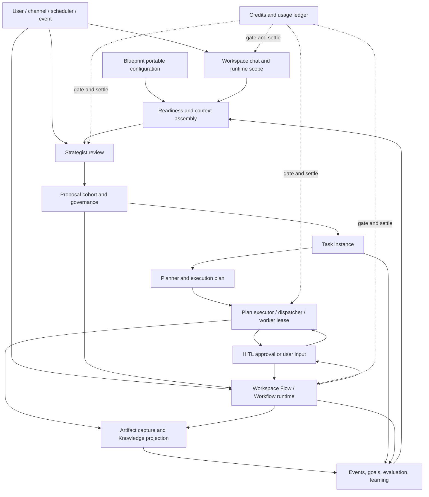
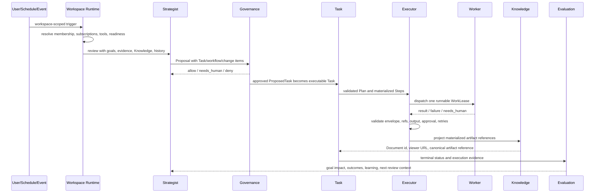

# Manor Workspace Architecture

This document describes the Workspace runtime and its verified boundaries. It
is a navigation and change-impact contract for engineers and coding agents.
The invariants below apply to the code paths named in each node and their
listed tests; they are not a claim that every legacy entrypoint has identical
coverage. When prose and code disagree, inspect the listed code entries and
update this document with the code change or mark the gap explicitly.

## Evidence status

- **Implemented** means a named code path exists and has a focused regression
  test. It does not mean every caller is covered.
- **Projection** means a runtime value is portable or user-visible only after
  the named projection/installer path runs; a filesystem path, model claim, or
  raw database row alone is not evidence.
- **Gap** means the repository currently has no complete implementation proof.
  A gap is recorded here so a future change cannot treat the statement as an
  existing guarantee.

## System view

The solid arrows are business-state transitions. The dotted credit edges are
cross-cutting controls. Governance is also cross-cutting: Proposal approval,
Plan/Step approval, Workflow action approval, and direct chat tool approval
share policy concepts but have different execution origins and resume paths.

## End-to-end operating loop

This is the autonomous Task path. A Workflow can be launched directly by the
user, scheduler, event, or Proposal; it does not become a Task Plan. Workflow
nodes execute inside `WorkflowRun`, while Task steps execute inside
`ExecutionPlan` and `ExecutionStep` through the Dispatcher.

## State ownership map

| State | Owner | Scope | Portable in Workspace Blueprint |
| --- | --- | --- | --- |
| Workspace shell and operating model | `Workspace` | Workspace | Yes, safe configuration only |
| Agent deployment | `AgentSubscription` | Workspace | Yes, by service key and agent slug |
| Strategist behavior constraints | `operating_model.strategist` | Workspace | Yes |
| Proposal cohort and decisions | Proposal records, proposed `Task` rows | Runtime | No |
| Task | `Task` | Workspace or entity | No |
| Plan and Step | `ExecutionPlan`, `ExecutionStep` | Task/runtime | No |
| Worker lease | `WorkLease` | Step/runtime | No |
| Workflow definition | `WorkflowDefinition` | Workspace or entity | Yes when Workspace-owned/bound |
| Workflow deployment | `WorkflowBinding` | Workspace | Yes |
| Workflow execution | `WorkflowRun` | Runtime | No |
| Automation definition | `ScheduledJob`, binding trigger config | Workspace | Yes when Workspace-scoped |
| Automation runs | `ScheduledJobRun` | Runtime | No |
| Artifact file | Entity filesystem | Workspace path | No as runtime output |
| Artifact index | `Document` plus provenance | Workspace/Knowledge | Starter content is portable; runtime artifacts are user-visible only after projection |
| Approval request/grant | HITL/governance records | Runtime/policy | Policy yes; decisions and tokens no |
| Credits | grants, reservations, transactions, usage | Entity/runtime | No |
| Task categories/SLA/escalation | task policy rows | Entity | No; configure through entity-level administration, never Workspace Blueprint |

## Node catalog

Each node uses the same fields so an impact review can be performed without
guessing ownership.

### WS-01: Create, install, and configure Workspace

Purpose: materialize the Workspace shell and its declared operating parts.

- Code entry: `packages/core/services/entity_service.py`,
  `packages/core/services/workspace_setup_service.py`,
  `packages/core/services/workspace_draft_service.py`,
  `packages/core/blueprints/installer.py`, and the Workspace/Blueprint API
  routers.
- State: `Workspace`, memberships, subscriptions, goals/stats, Knowledge
  folders, workflow definitions/bindings, scheduled jobs, policy, and install
  provenance.
- Success invariant: a fresh Workspace resolves all declared portable parts to
  new local identities, records blocking setup todos, and never reuses source
  row IDs or credentials.
- Failure boundary: partial setup must not be reported runnable. Installation
  either fails transactionally or returns explicit blocking todos/readiness.

### WS-02: Resolve runtime scope and Workspace chat

Purpose: turn a conversation, Task thread, channel message, or worker turn into
one bounded Workspace runtime envelope.

- Code entry: `packages/core/services/workspace_runtime.py`,
  `packages/core/workspace_chat/context.py`,
  `packages/core/workspace_chat/service.py`, `apps/api/routers/workspace_chat.py`,
  and `apps/api/routers/chat.py`.
- State: `Conversation`, `Message`, `workspace_id`, `task_id`, runtime/tool
  profiles, subscription-bound Agents, open pending actions, and task blockers.
- Success invariant: the turn sees only the target entity/Workspace/Task,
  correct service Agents and tools, plus unresolved HITL relevant to that
  conversation.
- Failure boundary: a missing/deleted/inaccessible Workspace fails closed and
  must not fall back to entity-wide tools, another Workspace, or a fresh task.

### WS-03: Readiness and context assembly

Purpose: determine whether useful work can start and assemble the evidence the
Strategist or agent is allowed to use.

- Code entry: `packages/core/services/workspace_readiness.py`,
  `packages/core/strategist/context.py`, Knowledge visibility/memory services,
  integration resolution, and goal/stat services.
- State: active subscriptions, allowed service keys, configured providers and
  channels, goals/stats, Knowledge nets, operating memory, recent work,
  governance policy, open proposals, and readiness blockers.
- Success invariant: readiness reflects concrete installed resources; context
  is Workspace-scoped and bounded, and declared missing dependencies remain
  visible as blockers rather than being invented by prompts.
- Failure boundary: missing setup changes the proposed work or blocks it before
  billable/external execution. Entity integrations unrelated to the Workspace
  must not leak into context.

### WS-04: Strategist review and Proposal generation

Purpose: convert current goals and evidence into a bounded, typed Proposal.

- Code entry: `packages/core/tasks/ai_tasks.py` review dispatch,
  `packages/core/strategist/service.py`, `context.py`, `prompt.py`,
  `proposal.py`, and review briefing services.
- State: `ReviewRun`, Proposal payload, proposed `Task` rows, proposal items,
  review evidence, and chat proposal card.
- Success invariant: `ProposedTask` owner/delegates are constrained to active
  subscriptions; dependencies and deliverables validate; duplicate/open work
  suppresses another scheduled cohort; Task rows are persisted only after the
  full Proposal validates.
- Failure boundary: invalid output gets bounded repair/failure, open proposals
  do not stack, credit exhaustion creates no new Task cohort, and Task creation
  is never derived from Blueprint `task_templates`.

### WS-05: Proposal governance and cohort decision

Purpose: decide whether proposed Tasks, workflow runs, experiments, human
requests, and Workspace changes may proceed.

- Code entry: Proposal governance in `packages/core/strategist/service.py`,
  `packages/core/proposals/`, and `packages/core/governance/approvals.py`.
- State: Proposal record/items, HITL request, standing grants, Task status,
  decision reason, and proposal chat card resolution.
- Success invariant: one cohort decision is traceable to its review; deny,
  needs-human, and allow produce distinct states; external action Tasks use the
  higher-risk action key; selected dependencies remain valid.
- Failure boundary: an expired or mismatched approval cannot authorize a
  different payload. Reject/cancel must not dispatch Tasks or Workflows.

### WS-06: Task lifecycle and planning

Purpose: turn an approved Task's business contract into a validated executable
Plan DAG.

- Code entry: `packages/core/models/task.py`,
  `packages/core/services/task_state_machine.py`,
  `packages/core/services/task_service.py`, `packages/core/plans/planner.py`,
  `packages/core/plans/schema.py`, `packages/core/plans/service.py`, and Task
  dispatch functions in `packages/core/tasks/ai_tasks.py`.
- State: `Task`, dependency links, expected output/deliverables, runtime
  capabilities, `ExecutionPlan`, and materialized `ExecutionStep` rows.
- Success invariant: Task status transitions are legal; the Plan is acyclic;
  service keys remain within owner/delegate scope; hard Task output is bound to
  exactly one terminal producer step; dependencies block until predecessor
  evidence is available.
- Failure boundary: planning failure, ambiguous terminal output, unsupported
  step kinds, unresolved dependencies, or missing credits must not mark the
  Task complete or start partial execution silently.

### WS-07: Plan execution, Dispatcher, and worker lease

Purpose: execute runnable Plan steps once, with retries and captured evidence.

- Code entry: `packages/core/plans/executor.py`,
  `packages/core/dispatcher/service.py`, `packages/core/models/worker.py`,
  internal worker execution, and `execute_lease`/`run_plan` tasks.
- State: Plan/Step status, `WorkLease`, execution claim, attempt counters,
  result envelope, tool evidence, error, and execution events.
- Success invariant: dependency-ready steps receive at most one active lease;
  only the claimed worker can complete it; results pass schema/reference and
  artifact checks; terminal Plan state reconciles exactly once to Task state.
- Failure boundary: stale/duplicate leases cannot complete a step; retry limits
  terminate visibly; a worker claim of success without required effects/files
  triggers replan/failure rather than false completion.

### WS-08: HITL, approval, pause, and resume

Purpose: pause an exact execution origin for approval, login, user input, or
operator intervention, then resume that same origin.

- Code entry: `packages/core/governance/approvals.py`,
  `packages/core/dispatcher/service.py::lease_needs_human`,
  `packages/core/services/task_blockers.py`,
  `packages/core/services/step_resume.py`, pending-action services, and
  Workspace chat resolution routes.
- State: HITL request, pending action, approval payload hash/token, paused
  Step/Lease/Workflow node, user response, consumed decision, and resolved UI
  message.
- Success invariant: approval is scoped to exact action and arguments; one
  response is consumed once; the original Task/Plan/Workflow resumes without
  starting a duplicate execution; terminal/cancel cleanup resolves stale cards.
- Failure boundary: expired/mismatched tokens fail closed. Login blockers are
  not converted into generic approvals. Manual pause/cancel clears processing
  state and does not leave the chat input locked.

### WS-09: Workspace Flow and Workflow runtime

Purpose: execute a reusable graph independently of the Task Plan runtime.

- Code entry: `packages/core/models/workflow.py`,
  `packages/core/services/workflow_service.py`,
  `packages/core/services/workspace_flow_launcher.py`,
  `packages/core/services/workspace_workflow_router.py`, and
  `packages/core/ai/workflow_runner.py`.
- State: `WorkflowDefinition`, Workspace `WorkflowBinding`, immutable run
  snapshot, `WorkflowRun`, variables, current node, step results, trace,
  project state, publication receipts, and action grants.
- Success invariant: launch resolves an active Workspace binding, validates
  inputs, creates one idempotent run, executes the snapshotted graph, preserves
  node output contracts, and exposes terminal status without querying deleted
  runs indefinitely.
- Failure boundary: a template ID is never executed directly; unknown/missing
  bindings and invalid inputs fail before run creation; partial/waiting nodes do
  not become completed; retries preserve lineage and do not repeat accepted
  external effects.

### WS-10: Artifact capture and Knowledge projection

Purpose: turn concrete execution output into a durable, visible Workspace
artifact contract.

- Code entry: `packages/core/ai/runtime/artifacts.py`,
  `packages/core/services/task_execution_reconcile.py`,
  `packages/core/services/artifact_knowledge.py`,
  `packages/core/services/knowledge_sync.py`,
  `packages/core/services/workspace_artifacts.py`, and artifact contracts.
- State: tool/result artifact refs, entity-relative filesystem path,
  Workspace artifact folder, `Document`, provenance, `document_id`, viewer URL,
  and Task/Workflow terminal result.
- Success invariant: the Task reconciliation and artifact projection paths turn
  a claimed local file into a durable Document with Workspace/Task provenance
  and canonical refs visible to the surfaces covered by those paths. Workflow
  trace projection also preserves declared artifact refs, but this is not a
  blanket guarantee that every Workflow node or external provider produces a
  Document.
- Failure boundary: a requested filename, remote job ID, or local path alone is
  not completion. For a required Task artifact, projection failure blocks
  completion; another entity's path or document is rejected. Workflow nodes
  that do not invoke the projection path remain a coverage gap.

### WS-11: Events, goals, evaluation, and learning loop

Purpose: record what happened and feed measured outcomes into later decisions.

- Code entry: workspace event models and ledger adapters,
  `packages/core/goals/`, `packages/core/strategist/evaluation.py`,
  `packages/core/services/workspace_evaluation.py`, review/consolidator code,
  and runtime learning services.
- State: append-only Workspace events, goal measurements, Task-goal links,
  predicted/actual impact, evaluation snapshots, consolidation reports, and
  learning candidates.
- Success invariant: the ledger adapters used by covered Task/Workflow/
  approval/goal transitions append correlated, idempotent events; measurements
  cite their source; the next Strategist review sees bounded,
  Workspace-scoped evidence rather than fabricated outcomes.
- Failure boundary: missing measurement does not become success; replay through
  the ledger service does not duplicate an event; evaluation failure does not
  rewrite the underlying Task/Workflow truth. Direct writes or legacy paths
  that bypass the adapters are not covered by this invariant.

### WS-12: Credits, reservations, and usage settlement

Purpose: prevent unaffordable AI/media work before dispatch and settle actual
usage exactly once afterward.

- Code entry: `packages/core/ai/runtime/billing.py`,
  `packages/core/services/credit_reservations.py`,
  `packages/core/services/usage_service.py`, LLM/media clients, scheduler
  preflight, and Task/Workflow execution wrappers.
- State: billing context, credit grant/balance, active reservation, usage
  record, transaction ledger, source identity, and BYOK attribution.
- Success invariant: the Runtime billing wrappers and the provider paths listed
  in the node checklist resolve entity/source, gate before the provider call,
  and use the reservation/settlement contract. BYOK usage is recorded without
  Manor credit debit where policy says so.
- Failure boundary: the tested chat, scheduler, Strategist, plan, media, TTS,
  embedding, and Workflow entrypoints fail closed on exhausted credits. This is
  not proof that an unlisted third-party or legacy provider path cannot bypass
  the gate; new billable entrypoints must add a wrapper and a regression test.

### WS-13: Pause, soft delete, restore, and purge

Purpose: stop a Workspace safely, preserve a restore window, then remove all
Workspace-owned runtime data after the grace period.

- Code entry: `packages/core/services/entity_service.py`,
  `packages/core/services/scheduler_service.py`,
  `packages/core/tasks/deletion_tasks.py`, Workspace API routes, and lifecycle
  tests.
- State: Workspace status/deleted timestamp, disabled/deleted automations,
  hidden Tasks/chat, restore state, purge candidates, and cascaded runtime rows.
- Success invariant: pause suppresses new autonomous work; soft delete
  immediately removes automations and access while preserving restorable data;
  the current purge implementation removes the workspace-scoped Tasks, Plans,
  Steps, Leases, Conversations/Messages, subscriptions, bindings, jobs,
  governance rows, goals, memory, and selected channel rows listed in
  `entity_service.purge_workspace`.
- Failure boundary: deleted Workspaces cannot be revived by chat, scheduler, or
  stale run polling. Restore does not silently recreate intentionally removed
  automations. Purge errors roll back per Workspace and retry later. **Known
  gap:** the current purge list does not yet cover every workspace-owned row,
  including WorkflowRun, WorkspaceEvent, RuntimeEvidence/learning rows,
  usage/reservation rows, document/file projections, ScheduledJobRun, and
  several execution/audit tables. Do not describe purge as complete until
  those ownership and deletion rules have dedicated code and tests.

### WS-14: Blueprint portability and lifecycle

Purpose: project supported Workspace configuration into a portable package and
materialize it into a new Workspace without copying runtime history.

- Code entry: `packages/core/blueprints/payload.py`, `exporter.py`,
  `installer.py`, `upgrade.py`, simulation/report modules, Blueprint API, and
  `.agents/skills/manor-workspace-blueprint/`.
- State: manifest, dependency contract, embedded agents/skills/Knowledge
  starters, operating recipe, Workflow graphs/bindings, scheduled jobs,
  goals/stats, governance policy, provenance, upgrade restore point, and todos.
- Success invariant: the tested v1.1 export/install paths validate, contain no
  secrets/source IDs/runtime Task state, install to new identities, expose
  blockers, and semantically round-trip the supported sections. Human-readable
  claims must match executable structure. This is evidence for the tested
  payload shapes, not every future optional field.
- Failure boundary: Proposal Tasks, Plans, Leases, Workflow runs, artifacts,
  approval tokens, credit state, and entity-wide rows are excluded unless an
  explicit safe portable contract exists. Non-empty unsupported sections fail
  closed rather than being silently ignored.

## Cross-node contracts

These edges require tests on both sides whenever either endpoint changes.

| Edge | Contract |
| --- | --- |
| WS-01 -> WS-03 | Installed rows must be discoverable by readiness/context |
| WS-02 -> WS-04 | Chat/manual triggers preserve Workspace and user scope |
| WS-03 -> WS-04 | Strategist uses installed services and real readiness only |
| WS-04 -> WS-05 | Proposal validates before governance and persistence |
| WS-05 -> WS-06 | Only approved, dependency-ready Tasks begin planning |
| WS-06 -> WS-07 | Plan DAG, capabilities, refs, and output contracts survive materialization |
| WS-07 -> WS-08 | Paused origin and resume identity remain exact |
| WS-07 -> WS-10 | Captured output becomes canonical artifact evidence |
| WS-09 -> WS-08 | Workflow HITL resumes the same run/node |
| WS-09 -> WS-10 | Workflow outputs and receipts remain visible after terminal state |
| WS-10 -> WS-11 | Evaluation consumes durable evidence, not model claims |
| WS-11 -> WS-04 | Next review sees measured outcomes and open work |
| WS-12 -> tested execution entries | Credit gate applies before provider calls on covered entrypoints; new entries require their own gate test |
| WS-13 -> tested runtime entries | Paused/deleted Workspace cannot launch new work on covered entrypoints; new entries require lifecycle guards |
| WS-14 -> WS-01/03/09 | Installed portable configuration recreates runnable semantics |

## Change impact procedure

For a proposed feature or fix:

1. Name its trigger and owning `WS-xx` node.
2. List persisted reads/writes and terminal evidence.
3. Follow outgoing edges in the cross-node table.
4. Check whether it adds a new entry surface that must pass WS-05/08 governance,
   WS-12 credits, WS-10 artifact projection, or WS-13 lifecycle guards.
5. Decide whether the change is portable configuration (WS-14) or runtime state.
6. Run the node checklist for the owner plus every crossed edge.
