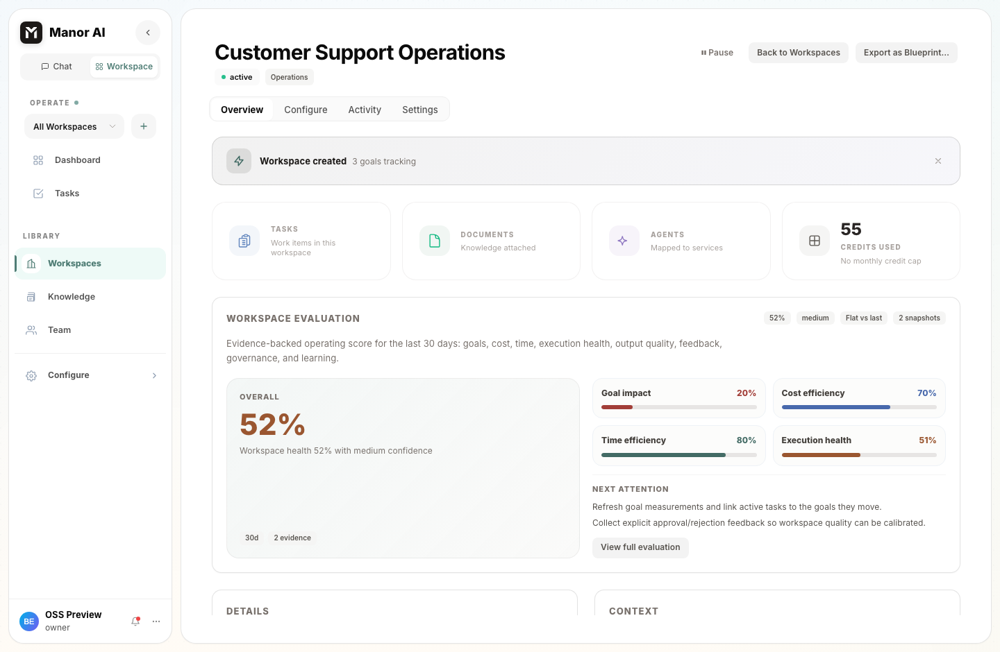
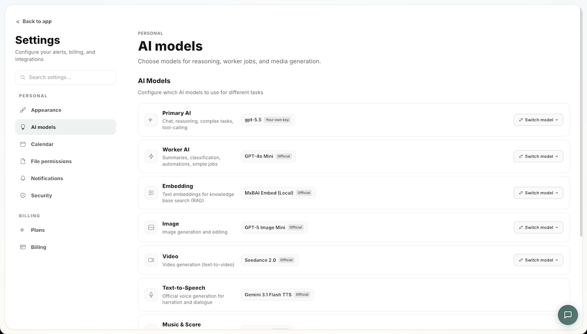
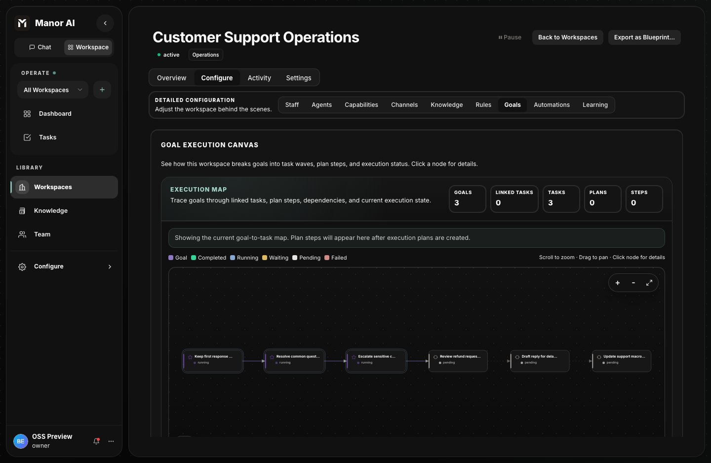
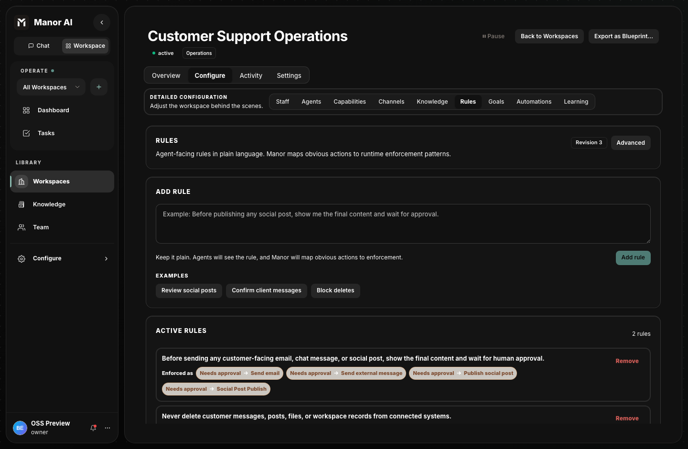

# Manor AI

<p align="center">
  <a href="https://manor-os.github.io/docs/manor-ai/quickstart"><strong>Quickstart</strong></a>
  ·
  <a href="https://manor-os.github.io/docs/manor-ai/"><strong>Docs</strong></a>
  ·
  <a href="https://github.com/manor-os/manor-ai"><strong>GitHub</strong></a>
  ·
  <a href="https://discord.gg/dS3HCZAB"><strong>Discord</strong></a>
  ·
  <a href="https://x.com/CalvinLin173676"><strong>Twitter</strong></a>
  ·
  <a href="https://manorai.xyz/"><strong>Website</strong></a>
</p>

<p align="center">
  <a href="LICENSE"></a>
  <a href="https://github.com/manor-os/manor-ai/stargazers"></a>
  <a href="https://discord.gg/dS3HCZAB"></a>
  <a href="https://x.com/CalvinLin173676"></a>
  <a href="https://manorai.xyz/"></a>
</p>

Manor AI is a self-hosted AI workspace runtime for teams that want agents,
documents, tasks, workflows, tools, and integrations under their own control.
It is built for BYOK deployments, local data ownership, and auditable
human-in-the-loop automation.

<video src="./docs-site/static/video/manor.webm" controls muted loop playsinline poster="./docs-site/static/img/manor-ai-runtime.png">
  Feature overview video: ./docs-site/static/video/manor.webm
</video>

[Watch the feature overview video](./docs-site/static/video/manor.webm).



## Why Manor AI

Most AI products stop at chat. Real teams need an operating layer around AI:
shared context, durable tasks, scoped tools, approvals, audit trails, and a way
to keep sensitive data inside infrastructure they control.

Manor AI is built for that layer.

### Own the runtime, not just the chat box

Manor AI brings the core surfaces of an AI workspace into one runtime: chat,
documents, agents, goals, workflows, reports, integrations, settings, and the
infrastructure around them. Self-host the app, database, files, agent runtime,
and integration surfaces; bring your own model keys instead of handing your
workspace to a hosted black box.



### Turn prompts into accountable work

Agents operate through goals, tasks, workspace context, tool permissions, and
human approval gates. Important automation leaves durable status, evidence, and
review points instead of disappearing into a one-off chat transcript.



### Make governance part of the product

Approval gates, scoped tools, audit logs, workspace permissions, and runtime
signals make automation inspectable before it touches critical workflows.



## How Manor AI works

Manor AI is organized around a workspace. A workspace is the boundary where
people, agents, documents, tasks, goals, tools, credentials, and governance
rules come together.

```text
Browser workspace
  |
  v
React web app
  |
  v
FastAPI control plane  <----> PostgreSQL + pgvector
  |                       |   Redis
  |                       |   MinIO / JuiceFS
  v
Worker runtime
  |
  +-- Agent task execution
  +-- Skills and scoped tools
  +-- Sandbox service
  +-- Webhooks / OAuth / Nango integrations
  +-- Human approval checkpoints
```

| Concept | What it means in Manor AI |
| --- | --- |
| Workspace | The operating boundary for people, agents, documents, tasks, knowledge, credentials, and audit history. |
| Agent | A reusable AI worker with instructions, model preferences, tool bindings, skills, and governance rules. |
| Goal / task | Durable work objects that turn prompts into trackable execution, evidence, comments, approvals, and status. |
| Knowledge | Uploaded documents and extracted text indexed for workspace retrieval with PostgreSQL and pgvector. |
| Tools / skills | Bounded capabilities and instruction packages that define what an agent can do and how it should do it. |
| HITL governance | Approval and deny policies that pause sensitive actions before agents affect external systems or critical data. |
| Integrations | Webhooks, OAuth/Nango connectors, API keys, and external callbacks for connecting Manor AI to your stack. |

## Core capabilities

| Capability | What you get |
| --- | --- |
| AI workspace | Chat, goals, tasks, documents, knowledge, reports, agents, and settings in one self-hosted UI. |
| Agent runtime | Tool-calling loop, model routing, skills, workspace context, task execution, and evidence logs. |
| BYOK model access | Provider keys are configured in your deployment; Manor AI does not require a hosted model proxy. |
| Governance | Human approval gates, scoped tools, workspace permissions, runtime signals, and audit-friendly task history. |
| Knowledge and files | Document uploads, generated artifacts, pgvector-backed retrieval, MinIO object storage, and entity filesystem support. |
| Integrations | Webhooks, OAuth provider configuration, optional Nango, API keys, MCP server catalog, and connector surfaces. |
| Operations | Docker Compose stack, health checks, backup guidance, sandbox isolation, configuration docs, and upgrade notes. |
| Extensibility | Add skills, tools, integrations, workers, model providers, and API clients without changing the core workspace model. |

## Quickstart

```bash
git clone https://github.com/manor-os/manor-ai.git && cd manor-ai
cp .env.example .env
docker compose up --build -d
```

Open **http://localhost:18080**.

Self-hosted mode seeds a local demo account by default:

```text
demo@manor.local / manor-demo
```

After signing in, add your model provider keys in Settings. Manor AI is BYOK in
self-hosted deployments; provider credentials stay in your deployment.

## First workflow to try

Use the first run to verify the whole system, not just the login page:

1. Start the Docker Compose stack and sign in with the demo account.
2. Add a model provider key in Settings.
3. Open the seeded workspace and inspect goals, tasks, documents, and rules.
4. Create or run a task so an agent uses workspace context and tools.
5. Trigger a governed action and confirm it pauses for human approval.
6. Review the resulting task status, evidence, comments, and audit trail.


## What ships in the OSS self-hosted stack

| Area | Included |
| --- | --- |
| Workspace app | React + Vite web UI for chat, tasks, agents, knowledge, documents, workflows, reports, and settings. |
| API runtime | FastAPI service with auth, RBAC, audit logging, OpenAPI docs, and workspace APIs. |
| Worker runtime | Celery-backed worker for background jobs, agent execution, task runs, and integration callbacks. |
| Data services | PostgreSQL 16 with pgvector, Redis, MinIO, and optional JuiceFS-backed entity storage. |
| Agent runtime | Tool-calling loop, skills, scoped tools, HITL approvals, task runners, and goal workflows. |
| Sandbox | Isolated execution service for code-producing tools and file-generating workflows. |
| Integrations | Webhooks, OAuth provider configuration, optional Nango, API keys, MCP catalog, and connector surfaces. |
| Docs and operations | Docusaurus docs, Docker Compose guide, configuration guide, security notes, backup/restore, and upgrade docs. |

The public OSS tree is designed for self-hosted deployments and local
evaluation. Managed hosting, private deployment automation, and commercial
cloud operations are separate from this repository. If you are extending Manor
AI, start from the OSS surfaces above: tools, skills, workers, webhooks,
OpenAPI clients, and deployment configuration.

## Extend Manor AI

- **Add skills** to teach agents domain-specific workflows and tool usage
  boundaries.
- **Bind tools** to agents so each worker has only the capabilities it needs.
- **Connect systems** through webhooks, OAuth provider configuration, Nango, API
  keys, and MCP servers.
- **Use the API** through the same FastAPI surface that powers the web app; see
  the [API reference](https://manor-os.github.io/docs/manor-ai/api-reference).
- **Customize deployment** with `.env`, Docker Compose profiles, storage,
  sandbox settings, and provider credentials.

## Deploy and operate

Before sharing a deployment with real users:

- Replace default secrets in `.env`.
- Use HTTPS for `APP_URL` and `PUBLIC_BASE_URL`.
- Keep PostgreSQL, Redis, MinIO, and sandbox services on private networks.
- Back up PostgreSQL and object storage together.
- Treat shell/code execution as sensitive and pair it with HITL governance.
- Start with narrow agent tool scopes, then loosen only after workflows are
  trusted.

Useful docs:

- [Quickstart](https://manor-os.github.io/docs/manor-ai/quickstart)
- [Configuration guide](https://manor-os.github.io/docs/manor-ai/configuration)
- [Docker Compose](https://manor-os.github.io/docs/manor-ai/docker-compose)
- [Architecture overview](https://manor-os.github.io/docs/manor-ai/architecture)
- [Security](https://manor-os.github.io/docs/manor-ai/security)
- [Backup and restore](https://manor-os.github.io/docs/manor-ai/operations/backup-restore)
- [Upgrades and releases](https://manor-os.github.io/docs/manor-ai/operations/upgrade-release)

## Contributing

For code changes, local development setup, tests, and style guidance, start
with [CONTRIBUTING.md](CONTRIBUTING.md) and the
[development docs](https://manor-os.github.io/docs/manor-ai/development). Keep
changes focused, add tests for behavior changes, and update documentation when
setup or user-facing behavior changes.

## Community

- Join the [Discord](https://discord.gg/dS3HCZAB).
- Follow updates on [Twitter / X](https://x.com/CalvinLin173676).
- Visit the [Manor AI website](https://manorai.xyz/).
- Use GitHub issues for bugs and feature requests.
- Report suspected vulnerabilities privately through [SECURITY.md](SECURITY.md).

## License

[Manor Sustainable Use License 1.0](LICENSE) -- Copyright (c) 2026 Manor AI.

The public source may be self-hosted, modified, and used internally. Reselling,
white-labeling, or offering a hosted/managed competing service requires a
separate written commercial agreement with Manor AI. The Manor AI name and
marks are governed separately by [TRADEMARKS.md](TRADEMARKS.md).
