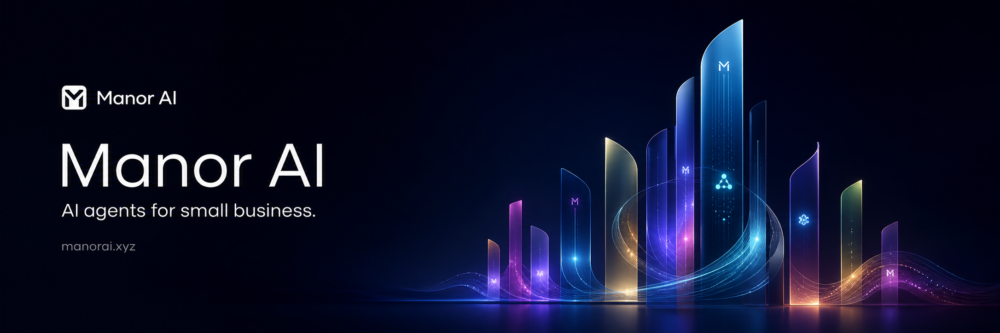

<p align="center">
  
</p>

<h1 align="center">Manor AI</h1>

<p align="center">
  <a href="README.md">English</a> | <strong>简体中文</strong>
</p>

<p align="center">
  <strong>自托管 AI 工作区:受治理的 Agent、任务、工具与知识。</strong>
</p>

<p align="center">
  让 Agent 基于团队知识和受限工具执行工作,敏感操作先经人工审批,
  运营数据始终留在你自己掌控的基础设施内。
</p>

<p align="center">
  <a href="https://github.com/manor-os/manor-ai"><strong>⭐ Star Manor AI</strong></a>
  ·
  <a href="#5-分钟快速开始"><strong>🚀 用 Docker Compose 运行</strong></a>
  ·
  <a href="https://github.com/manor-os/manor-ai/issues/new/choose"><strong>💬 提交 Issue</strong></a>
</p>

<p align="center">
  <a href="https://manor-os.github.io/docs/manor-ai/zh-Hans/quickstart"><strong>5 分钟快速开始</strong></a>
  ·
  <a href="https://manor-os.github.io/docs/manor-ai/zh-Hans/"><strong>中文文档</strong></a>
  ·
  <a href="https://github.com/manor-os/manor-ai"><strong>GitHub</strong></a>
  ·
  <a href="https://discord.gg/De6fg5Swnw"><strong>Discord</strong></a>
  ·
  <a href="https://x.com/CalvinLin173676"><strong>Twitter</strong></a>
  ·
  <a href="https://manorai.xyz/"><strong>官网</strong></a>
</p>

<p align="center">
  <a href="LICENSE"></a>
  <a href="https://github.com/manor-os/manor-ai/stargazers"></a>
  <a href="https://discord.gg/De6fg5Swnw"></a>
  <a href="https://x.com/CalvinLin173676"></a>
  <a href="https://manorai.xyz/"></a>
</p>

<div align="center">
  <video src="https://github.com/user-attachments/assets/89aac5f8-3fbb-405b-81e0-6522e8df1513" width="900" controls poster="./docs-site/static/img/social-card.png"></video>
</div>

## 为什么选择 Manor AI

大多数 AI 产品止步于聊天。真实团队需要的是围绕 AI 的运营层:共享上下文、
可持续追踪的任务、受限工具、审批流程、审计记录,以及把敏感数据留在自己
基础设施内的方式。

Manor AI 就是为这一层而生:模型选择、工作区记忆、任务、权限与人工审核在
这里汇合成一个产品界面。

### 拥有运行时,而不只是聊天框

Manor AI 把 AI 工作区的核心界面收进一个运行时:聊天、文档、Agent、目标、
工作流、报表、集成、设置,以及支撑它们的基础设施。自托管应用、数据库、
文件、Agent 运行时和集成界面;自带模型密钥,而不是把工作区交给托管黑盒。
模型提供商密钥配置在你的部署中,运营数据保留在你的基础设施内。

### 把提示词变成可追责的工作

Agent 通过目标、任务、工作区上下文、工具权限与人工审批闸口开展工作。重要
的自动化会留下持久的状态、证据与审核节点,而不是消失在一次性的聊天记录
里。目标会拆解为关联的执行步骤,团队可以检查并持续改进。

### 让治理成为产品的一部分

审批闸口、受限工具、审计日志、工作区权限与运行时信号,使自动化在触及关键
流程之前就可被审视。规则对运营者可见,并映射为运行时中的强制模式。

## Manor AI 如何工作

Manor AI 围绕工作区组织。工作区是人、Agent、文档、任务、目标、工具、凭据
与治理规则汇合的边界。

```text
Browser workspace
  |
  v
React web app
  |
  v
FastAPI control plane  <----> PostgreSQL + pgvector
  |                       |   Redis
  |                       |   MinIO / JuiceFS
  v
Worker runtime
  |
  +-- Agent task execution
  +-- Skills and scoped tools
  +-- Sandbox service
  +-- Webhooks / OAuth / Nango integrations
  +-- Human approval checkpoints
```

| 概念 | 在 Manor AI 中的含义 |
| --- | --- |
| 工作区 | 人、Agent、文档、任务、知识、凭据与审计历史的运营边界。 |
| Agent | 可复用的 AI 工作者,带指令、模型偏好、工具绑定、技能与治理规则。 |
| 目标 / 任务 | 持久的工作对象,把提示词变成可追踪的执行、证据、评论、审批与状态。 |
| 知识 | 上传的文档与抽取的文本,通过 PostgreSQL + pgvector 建立工作区检索。 |
| 工具 / 技能 | 有边界的能力与指令包,定义 Agent 能做什么、该怎么做。 |
| HITL 治理 | 审批与拒绝策略,在 Agent 影响外部系统或关键数据前暂停敏感操作。 |
| 集成 | Webhook、OAuth/Nango 连接器、API 密钥与外部回调,把 Manor AI 接入你的技术栈。 |

## 核心能力

| 能力 | 你将获得 |
| --- | --- |
| AI 工作区 | 聊天、目标、任务、文档、知识、报表、Agent 与设置,集中在一个自托管界面。 |
| Agent 运行时 | 工具调用循环、模型路由、技能、工作区上下文、任务执行与证据日志。 |
| BYOK 模型接入 | 提供商密钥配置在你的部署中;Manor AI 不要求托管模型代理。 |
| 治理 | 人工审批闸口、受限工具、工作区权限、运行时信号与便于审计的任务历史。 |
| 知识与文件 | 文档上传、生成产物、pgvector 检索、MinIO 对象存储与实体文件系统。 |
| 集成 | Webhook、OAuth 提供商配置、可选 Nango、API 密钥、MCP 服务目录与连接器界面。 |
| 运维 | Docker Compose 服务栈、健康检查、备份指南、沙箱隔离、配置文档与升级说明。 |
| 可扩展性 | 添加技能、工具、集成、worker、模型提供商与 API 客户端,无需改动核心工作区模型。 |

## 5 分钟快速开始

```bash
git clone https://github.com/manor-os/manor-ai.git && cd manor-ai
cp .env.example .env
docker compose up --build -d
```

打开 **http://localhost:18080**。

自托管模式默认预置一个本地演示账号:

```text
demo@manor.local / manor-demo
```

登录后在设置中添加你的模型提供商密钥。自托管部署下 Manor AI 采用 BYOK
(自带密钥),模型凭据只保存在你自己的部署中。

## 第一个值得尝试的流程

用第一次运行验证整个系统,而不只是登录页:

1. 启动 Docker Compose 服务栈,用演示账号登录。
2. 在设置中添加模型提供商密钥。
3. 打开预置工作区,查看目标、任务、文档与规则。
4. 创建或运行一个任务,让 Agent 使用工作区上下文与工具。
5. 触发一个受治理的操作,确认它会暂停等待人工审批。
6. 查看任务的状态、证据、评论与审计记录。

## OSS 自托管栈包含什么

| 领域 | 包含内容 |
| --- | --- |
| 工作区应用 | React + Vite Web 界面:聊天、任务、Agent、知识、文档、工作流、报表与设置。 |
| API 运行时 | FastAPI 服务:认证、RBAC、审计日志、OpenAPI 文档与工作区 API。 |
| Worker 运行时 | 基于 Celery 的 worker:后台任务、Agent 执行、任务运行与集成回调。 |
| 数据服务 | PostgreSQL 16 + pgvector、Redis、MinIO,以及可选的 JuiceFS 实体存储。 |
| Agent 运行时 | 工具调用循环、技能、受限工具、人工审批、任务执行器与目标工作流。 |
| 沙箱 | 面向产码工具与产文件流程的隔离执行服务。 |
| 集成 | Webhook、OAuth 提供商配置、可选 Nango、API 密钥、MCP 目录与连接器界面。 |
| 文档与运维 | Docusaurus 文档、Docker Compose 指南、配置指南、安全说明、备份/恢复与升级文档。 |

公开的 OSS 代码树面向自托管部署与本地评估。托管服务、私有部署自动化与
商业云运营不在本仓库范围内。若要扩展 Manor AI,请从上述 OSS 界面入手:
工具、技能、worker、webhook、OpenAPI 客户端与部署配置。

## 扩展 Manor AI

- **添加技能**,教会 Agent 领域工作流与工具使用边界。
- **绑定工具**,让每个 Agent 只拥有它需要的能力。
- **连接系统**:webhook、OAuth 提供商配置、Nango、API 密钥与 MCP 服务。
- **使用 API**:与 Web 应用同一套 FastAPI 接口;参见
  [API 参考](https://manor-os.github.io/docs/manor-ai/zh-Hans/api-reference)。
- **定制部署**:`.env`、Docker Compose profile、存储、沙箱设置与提供商凭据。

## 部署与运维

向真实用户开放部署前:

- 替换 `.env` 中的默认密钥。
- `APP_URL` 与 `PUBLIC_BASE_URL` 使用 HTTPS。
- PostgreSQL、Redis、MinIO 与沙箱服务保持在私有网络。
- PostgreSQL 与对象存储一起备份。
- 把 shell/代码执行视为敏感能力,配合人工审批治理。
- 从最小的 Agent 工具范围开始,流程可信后再逐步放宽。

常用文档:

- [快速开始](https://manor-os.github.io/docs/manor-ai/zh-Hans/quickstart)
- [配置指南](https://manor-os.github.io/docs/manor-ai/zh-Hans/configuration)
- [Docker Compose](https://manor-os.github.io/docs/manor-ai/zh-Hans/docker-compose)
- [架构概览](https://manor-os.github.io/docs/manor-ai/zh-Hans/architecture)
- [安全](https://manor-os.github.io/docs/manor-ai/zh-Hans/security)
- [备份与恢复](https://manor-os.github.io/docs/manor-ai/zh-Hans/operations/backup-restore)
- [升级与发布](https://manor-os.github.io/docs/manor-ai/zh-Hans/operations/upgrade-release)

## 参与贡献

代码改动、本地开发环境、测试与风格规范,请从
[CONTRIBUTING.md](CONTRIBUTING.md) 和
[开发文档](https://manor-os.github.io/docs/manor-ai/zh-Hans/development)开始。
保持改动聚焦,为行为变化添加测试,并在安装方式或用户可见行为变化时同步
更新文档。

## 社区

- 加入 [Discord](https://discord.gg/De6fg5Swnw)。
- 在 [Twitter / X](https://x.com/CalvinLin173676) 关注动态。
- 访问 [Manor AI 官网](https://manorai.xyz/)。
- 通过 GitHub Issue 反馈 Bug 与功能请求。
- 疑似安全漏洞请按 [SECURITY.md](SECURITY.md) 私下报告。

## 许可证

[Sustainable Use License 1.0](LICENSE) —— Copyright (c) 2026 Manor AI。

Manor AI 是 fair-code:源码可见、可自托管、可扩展,遵循 Sustainable Use
License 1.0。允许内部业务、个人与非商业使用。将 Manor AI 白标、向他人
收费提供托管的 Manor AI 服务,或以其他方式商业化提供本软件,需与
Manor AI 另行签署书面协议。围绕客户内部部署的商业咨询与支持是允许的。
Manor AI 名称与商标由 [TRADEMARKS.md](TRADEMARKS.md) 单独约束。

许可证文本沿用
[n8n 发布的 Sustainable Use License 1.0](https://github.com/n8n-io/n8n/blob/master/LICENSE.md)。
